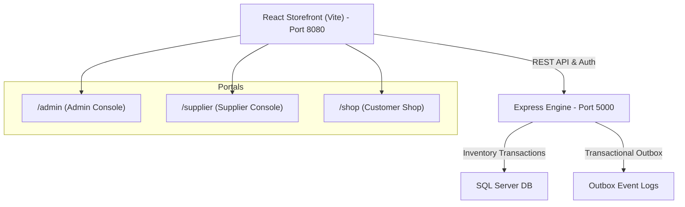

# BrandCreator Ecosystem

Welcome to the **BrandCreator Ecosystem**—a high-performance, role-based e-commerce, warehousing, and inventory management platform. 

The ecosystem separates physical warehouse inventory (`MASTER` ledger) from public storefront storefront inventory (`SELL` ledger) and handles transactions atomically with role-based validation, double-ledger reconciliation, and asynchronous transactional outbox patterns.

---

## 🏗️ Architecture & Component Overview

The system is composed of two primary layers operating locally:



1. **Express Backend Engine (`bc_engine`)**:
   * Runs on Node.js/Express at **`http://localhost:5000`**.
   * Interfaces with SQL Server to execute double-ledger updates.
   * Manages access controls (RBAC), outbox event publishing, and automated reconciliation tests.
2. **React Storefront (`bc_storefront`)**:
   * Single Page Application styled with high-fidelity, modern dark glassmorphism, glowing micro-animations, and fluid responsive design.
   * Compiled for production and served locally via IIS at **`http://localhost:8080`**.

---

## 🚦 Portals & Local Navigation

The storefront is routed locally via IIS routing fallbacks:

| Portal | Local URL | Role & Primary Actions |
| :--- | :--- | :--- |
| **Customer Shop** | `http://localhost:8080/shop` | Search catalog, check cart validation, place orders, mock checkout settlement. |
| **Supplier Dashboard** | `http://localhost:8080/supplier` | Create products, deposit physical stock (`MASTER`), request virtual transfer to `SELL` storefront. |
| **Admin Dashboard** | `http://localhost:8080/admin` | Approve products via QC, approve virtual stock transfers (`MASTER -> SELL`), review transactional metrics. |

---

## ⚡ One-Click Local Management

We have prepared three double-clickable launchers at the root of the project, which are also placed directly as shortcuts on your Windows **Desktop**:

1. **`BrandCreator - Start`** (`Start-BrandCreator.bat`):
   * Spins up the Express backend engine on port 5000 in the background.
   * Verifies immediate backend and local IIS availability.
2. **`BrandCreator - Verify`** (`Verify-BrandCreator.bat`):
   * Runs complete system diagnostics (Port checks, routing status, compilation builds, and E2E inventory tests).
3. **`BrandCreator - Stop`** (`Stop-BrandCreator.bat`):
   * Gracefully shuts down the background Express backend process utilizing port 5000.

---

## 🧪 E2E Manual QA Testing Flow

To test the complete workflow end-to-end, follow this corrected sequence:

### 📋 Step-by-Step Operator Flow

1. **Supplier - Create Product**: Go to `/supplier` and click **`Initialize New Product Ledger`** to create a product (starts as `DRAFT`).
2. **Supplier - Submit for QC**: On the Supplier dashboard, click **`Submit for QC`** on the newly created product.
3. **Admin - Approve QC**: Go to `/admin` under the **QC Queue** tab, and click **`Approve Design`** to transition the product to `APPROVED`.
4. **Supplier - Add MASTER Stock**: Go back to `/supplier`, locate the approved product, click **`[+] Add Stock`**, and deposit e.g. `100` units of physical `MASTER` stock.
5. **Supplier - Request Transfer**: On the Supplier dashboard, click **`Request Transfer`** to initiate a virtual transfer (e.g., `40` units from `MASTER` to `SELL`).
6. **Admin - Approve Transfer**: Go to `/admin` under the **Stock Transfers** tab, and click **`Approve`** on the transfer request.
7. **Shop - Buy Product**: Go to `/shop`. The product now appears in the Shop. Add it to your cart, click **`Reserve & Checkout`**, and note the generated `orderRef`.
8. **Admin - Confirm Payment**: Go to `/admin` under the **Recent Orders** tab, locate the order, and click **`Confirm Payment (Dev)`**.
9. **Supplier/Admin - Verify Balance**: Go to `/supplier` or `/admin` (under **Inventory Ledgers**) and verify that the virtual ledger (`SELL`) has been reduced by the purchased quantity.

---

### 🗺️ Visual Flow Overview

```text
Supplier:
Create product -> Submit for QC

Admin:
Approve product in QC Queue

Supplier:
Add MASTER stock -> Request MASTER to SELL transfer

Admin:
Approve transfer

Shop:
Buy product -> orderRef appears

Admin:
Confirm payment

Supplier/Admin:
Verify SELL stock reduced
```


---

## ⏪ Rollback Checkpoint History

Should you need to roll back or inspect prior iterations, the following git commits form the official checkpoint series:

| Commit Hash | Action Name & Summary |
| :--- | :--- |
| **`248025a`** | **Fix powershell process redirection issue in start script** <br> Adjusts start script processes to support redirection safely on local systems. |
| **`8b3f7f0`** | **Create comprehensive project README documentation** <br> Introduces the operational developer manual. |
| **`2632f54`** | **Add Windows desktop shortcut generator script** <br> Generates dynamic `.lnk` Desktop launchers for developer shortcuts. |
| **`fbd953f`** | **Polish admin and supplier dashboard experience** <br> Overhauls dashboard UI/UX to match dark glassmorphic storefront. |
| **`b3ad947`** | **Add double-click BrandCreator launcher commands** <br> Creates the double-click `.bat` launcher suite. |
| **`6dd8102`** | **Add one-click local launchers, stop scripts, and diagnostic verification suite** <br> Introduces PowerShell automation pipelines. |
| **`b121506`** | **Initial BrandCreator ecosystem checkpoint** <br> Original workspace state backup. |
