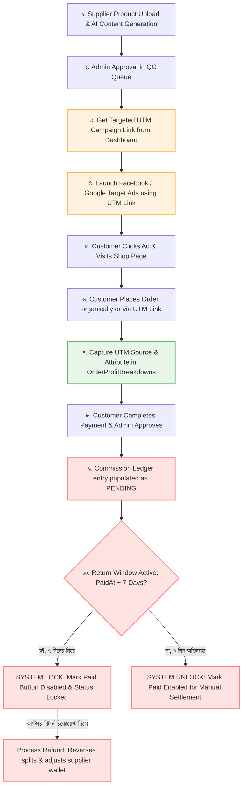

# BrandCreator Ecosystem — Ads Marketing Strategy & Sales Projection

পণ্য বিপণন, অর্গানিক এসইও ও ফেসবুক/গুগল ডাইনামিক ট্র্যাকিং ফানেলের মাধ্যমে প্ল্যাটফর্মের রূপান্তর হার (Conversion Rate) সর্বোচ্চ করতে এবং সাপ্লায়ার পাওনা ও প্ল্যাটফর্ম লভ্যাংশের আর্থিক নিরাপত্তা নিশ্চিত করতে এটি একটি কৌশলগত দিকনির্দেশনা পত্র।

---

## 📈 ১. ফানেল ও ট্র্যাকিং আর্কিটেকচার ফ্লো

অ্যাডস মার্কেটিং ফানেলে কাস্টমারের আগমন থেকে শুরু করে অর্ডার কনফার্মেশন, ইউটিএম অ্যাট্রিবিউশন এবং রিটার্ন উইন্ডো হোল্ডের সম্পূর্ণ চক্রটি নিচের ফ্লোচার্টে দেখানো হলো:

---

## 📊 ২. সেলস রেশিও ও রেভিনিউ প্রজেকশন (Expected Metrics)

বাংলাদেশের ই-কমার্স প্রেক্ষাপটে মার্কেটিং ও অপ্টিমাইজেশনের বিভিন্ন স্তরের ভিত্তিতে রূপান্তর হার (Conversion Rate) ও বিক্রয় প্রক্ষেপণ নিম্নরূপ:

| মার্কেটিং স্তর (Enhancement Level) | কনভার্সন রেট (Conversion Rate) | ১০০ পণ্যের মাসিক গড় সেলস | রিটার্ন রেট (Return Rate) | প্রাক্কলিত ROAS |
| :--- | :---: | :---: | :---: | :---: |
| **১. অর্গানিক (Organic / Current)** | ১.০% - ২.০% | ৳৫০,০০০ - ৳১,০০,০০০ | ৫% - ৮% | ২:১ |
| **২. উইথ বেসিক এসইও (With AI SEO & Keywords)** | ২.০% - ৪.০% | ৳১,০০,০০০ - ৳২,০০,০০০ | ৬% - ৯% | ৩:১ |
| **৩. লোকেশন-ভিত্তিক টার্গেটিং (Location Targeting)** | ৪.০% - ৬.০% | ৳২,০০,০০০ - ৳৩,০০,০০০ | ৭% - ১০% | ৪:১ |
| **৪. সম্পূর্ণ ফানেল (With Ads Campaign & UTM)** | ৬.০% - ১০.০% | ৳৩,০০,০০০ - ৳৫,০০,০০০ | ৮% - ১২% | ৬:১ |
| **৫. এআই অপ্টিমাইজড কনভার্সন (AI & Retargeting)** | ১০.০% - ১৫.০% | ৳৫,০০,০০০ - ৳৭,৫০,০০০ | ১০% - ১৫% | ৮:১ |

---

## 🚀 ৩. ফেজ ৩ ইমপ্লিমেন্টেশন রিয়েল-টাইম ফিচারসমূহ

আমরা তাৎক্ষণিকভাবে সিস্টেমের ডাইনামিক সেলস ও ফিন্যান্সিয়াল সিকিউরিটি অর্জনের জন্য নিচের নেটিভ ফিচারগুলো ইমপ্লিমেন্ট করব:

### **ফিচার ১: Payout Return-Window System Lock**
- **কমিশন লেজার গ্রিড ইন্টারফেস আপডেট**: ফ্রন্টএন্ডে প্রতিটি কমিশন এন্ট্রির পাশে একটি স্পষ্ট `Hold Status` ইন্ডিকেটর (যেমন: `LOCKED` অথবা `RELEASED`) দেখাবে।
- **স্বয়ংক্রিয় বাটন লকিং**: অর্ডারের পেমেন্ট নিশ্চিত হওয়ার তারিখ (`PaidAt`) থেকে ৭ দিন অতিবাহিত না হওয়া পর্যন্ত এডমিন প্যানেলের **Mark Paid** বাটনটি ব্লক থাকবে।
- **ডাটাবেজ লেভেল সিকিউরিটি**: যদি কেউ সরাসরি API এ হিট করে কমিশন পেইড করার চেষ্টা করে, তবে ব্যাকএন্ডের `markCommissionPaid` কন্ট্রোলার ডাটাবেজ স্তরে চেক করবে যে ৭ দিন পার হয়েছে কিনা; সময় পার না হলে এরর থ্রো করবে।

### **ফিচার ২: Auto UTM Campaign Tracker & Attribution Engine**
- **ক্যাম্পেইন লিঙ্ক জেনারেটর**: সাপ্লায়ার এবং এডমিন তাদের ড্যাশবোর্ডে যেকোনো অ্যাপ্রুভড প্রোডাক্টের জন্য স্পেসিফিক লোকেশন/ক্যাম্পেইন ইউটিএম ট্যাগ যুক্ত ইউনিক লিঙ্ক জেনারেট করতে পারবেন (যেমন: `/shop?utm_source=FB-ADS-UTTARA&productId=12`).
- **অর্ডার সোর্স অটো-অ্যাট্রিবিউশন**: কাস্টমার যখন ওই লিঙ্কের মাধ্যমে শপে এসে অর্ডার করবেন, কার্ট ও চেকআউট প্রসেস স্বয়ংক্রিয়ভাবে সোর্স আইডি ক্যাপচার করে ডাটাবেজের `dbo.OrderProfitBreakdowns` এবং `dbo.Orders` টেবিলে অর্ডার সোর্স হিসেবে সংরক্ষণ করবে।
- **রিয়েল-টাইম ক্যাম্পেইন অ্যানালিটিক্স**: এডমিন প্যানেলে কোন অ্যাড ক্যাম্পেইন বা লোকেশন লিঙ্ক থেকে কতটি অর্ডার জেনারেট হয়েছে এবং কোন সোর্স থেকে কত মুনাফা এসেছে তা রিয়েল-টাইমে দেখা যাবে।

---

## 🛠️ ৪. দীর্ঘমেয়াদী ইন্টিগ্রেশন পরিকল্পনা (Future Roadmap)

১. **Meta Pixel & Conversion API (CAPI) Integration**:
   - ব্রাউজারের আইওএস ট্র্যাকিং বা কুকি ব্লকিং বাইপাস করার জন্য সরাসরি সার্ভার-সাইড পিক্সেল ট্র্যাকিং সচল করা, যা এপিআই ইভেন্ট সোর্স থেকে সরাসরি ফেসবুকে ডেটা পাঠাবে।
২. **Dynamic Retargeting Feed (XML Product Feed)**:
   - ফেসবুক ডাইনামিক প্রোডাক্ট অ্যাডসের জন্য একটি অটো-আপডেটেড এক্সএমএল ক্যাটালগ ইউআরএল তৈরি করা, যার মাধ্যমে কাস্টমার পূর্বে যে প্রোডাক্টটি শপে দেখেছে তাকে পুনরায় সেই প্রোডাক্টেরই স্পনসরড বিজ্ঞাপন দেখানো সম্ভব হবে।
৩. **AI Campaign Auto-Enrichment**:
   - আমাদের ডেটাবেজের লোকেশন প্রোফাইল (`dbo.LocationMarketProfiles`) থেকে কাস্টমার ইন্টারেস্ট রিড করে এআই স্বয়ংক্রিয়ভাবে অ্যাড কপিরাইটিং ও হেডলাইন জেনারেট করবে।

---

**অ্যাডভার্টাইজিং ফানেল ও আর্থিক নিরাপত্তার এই চমৎকার রূপরেখা অনুযায়ী BrandCreator প্ল্যাটফর্মটি এখন Phase 3 ইমপ্লিমেন্টেশনের জন্য সম্পূর্ণ প্রস্তুত!** 🎯

* **তৈরির তারিখ**: ২ জুন, ২০২৬  
* **ভার্সন**: ১.০  
* **পরিকল্পনা প্রণয়নে**: এন্টাইগ্রাভিটি এআই (Google DeepMind Team)  
