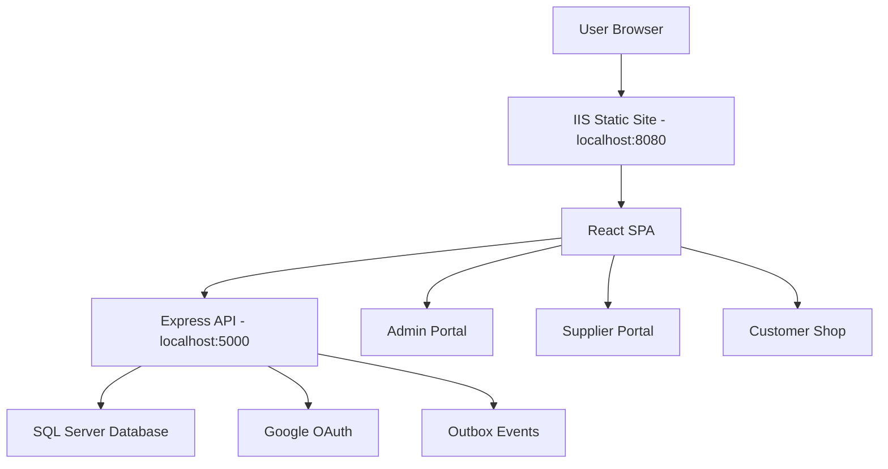

# BrandCreator Ecosystem - বাংলা প্রজেক্ট ডকুমেন্টেশন

## ১. সংক্ষিপ্ত পরিচিতি

**BrandCreator Ecosystem** হলো একটি আধুনিক e-commerce, inventory, supplier management এবং order processing platform। এই system এমনভাবে তৈরি করা হয়েছে যেন একজন supplier product create করতে পারে, admin quality check করতে পারে, warehouse stock আলাদা ledger-এ track করা যায়, customer shop থেকে order করতে পারে, এবং payment confirm হলে stock automatic কমে যায়।

এই platform-এর মূল শক্তি হলো **Double Ledger Inventory System**। এখানে physical warehouse stock এবং customer-facing shop stock আলাদা রাখা হয়:

- `MASTER` ledger: warehouse বা physical stock।
- `SELL` ledger: customer shop-এ বিক্রির জন্য available stock।

এর ফলে business owner সবসময় জানতে পারে:

- warehouse-এ আসলে কত stock আছে।
- shop-এ কত stock বিক্রির জন্য open করা হয়েছে।
- কত stock reserved আছে।
- payment confirm হলে কত stock sold হয়েছে।
- ledger mismatch আছে কি না।

এই structure small business, supplier marketplace, warehouse-backed commerce, fashion/product brand, local inventory hub এবং multi-supplier e-commerce system-এর জন্য খুব useful।

## ২. এই platform কোন সমস্যা solve করে

সাধারণ e-commerce বা inventory system-এ অনেক সময় stock ভুল দেখায়। supplier stock দিয়েছে, admin approve করেনি, customer order করেছে কিন্তু payment হয়নি, warehouse stock আছে কিন্তু storefront-এ দেখানো হয়নি - এই সব জায়গায় mismatch তৈরি হয়।

BrandCreator এই problemগুলো solve করে:

- Product live হওয়ার আগে admin QC approval বাধ্যতামূলক।
- Physical stock (`MASTER`) আর selling stock (`SELL`) আলাদা।
- Supplier চাইলে সব warehouse stock একসাথে shop-এ দিতে পারে না। transfer request লাগে।
- Admin transfer approve করলে তবেই shop stock বাড়ে।
- Customer order করলে stock আগে reserve হয়।
- Payment confirm হলে stock permanently sell/commit হয়।
- Cancel হলে reserved stock আবার release হয়।
- System reconciliation করে ledger ঠিক আছে কি না verify করে।

## ৩. কারা এই platform ব্যবহার করতে পারবে

### Business Owner / SuperAdmin

- পুরো system monitor করতে পারবেন।
- QC approval, transfer approval, payment confirmation করতে পারবেন।
- low stock, order, outbox event, system health দেখতে পারবেন।

### Admin Team

- supplier product review করবে।
- product approve/reject করবে।
- stock transfer request approve করবে।
- order/payment flow monitor করবে।

### Supplier

- নতুন product create করবে।
- product QC-এর জন্য submit করবে।
- approved product-এ physical stock add করবে।
- `MASTER` থেকে `SELL` stock transfer request করবে।
- ledger balance দেখবে।

### Customer

- shop থেকে approved ও in-stock product দেখবে।
- cart-এ product add করবে।
- checkout করে order create করবে।
- order reference পাবে।

## ৪. তিনটি প্রধান portal

| Portal | URL | মূল কাজ |
| :--- | :--- | :--- |
| Admin Dashboard | `http://localhost:8080/admin` | QC approval, stock transfer approval, order/payment, system monitoring |
| Supplier Dashboard | `http://localhost:8080/supplier` | product create, QC submit, stock add, transfer request |
| Customer Shop | `http://localhost:8080/shop` | product browse, cart, checkout |

## ৫. পুরো business flow সহজ ভাষায়

BrandCreator-এর core business journey এইভাবে কাজ করে:

```text
Supplier:
Product create -> Submit for QC

Admin:
QC approve

Supplier:
Add MASTER stock -> Request MASTER to SELL transfer

Admin:
Approve transfer

Customer:
Shop থেকে product buy

Admin:
Confirm payment

System:
SELL stock কমে যায়, ledger reconcile হয়
```

### Step-by-step example

ধরা যাক supplier একটি নতুন shirt sell করতে চায়।

1. Supplier `/supplier` portal-এ product create করল।
2. Product প্রথমে `DRAFT` state-এ থাকে।
3. Supplier product QC-এর জন্য submit করল।
4. Admin `/admin` portal-এ গিয়ে QC Queue থেকে product approve করল।
5. Product approved হওয়ার পর supplier physical warehouse stock add করল, যেমন ৫০ units।
6. Supplier `MASTER` থেকে `SELL` ledger-এ ১৫ units transfer request করল।
7. Admin transfer approve করল।
8. Customer `/shop` portal-এ product দেখতে পেল, stock ১৫ units।
9. Customer ২ units order করল।
10. System ২ units reserve করল।
11. Admin payment confirm করল।
12. `SELL` stock ১৫ থেকে ১৩ হলো।
13. Ledger reconciliation দেখাল system ঠিক আছে।

## ৬. Double Ledger Inventory System

BrandCreator-এর inventory system সাধারণ stock counter না। এটি double-ledger design ব্যবহার করে।

### MASTER Ledger

এটি physical warehouse stock। supplier বা business owner warehouse-এ যে stock বাস্তবে রাখে, সেটি এখানে থাকে।

উদাহরণ:

```text
MASTER onHandQty = 50
MASTER reservedQty = 15
MASTER availableQty = 35
```

### SELL Ledger

এটি customer shop-এ visible stock। product customer-facing storefront-এ show করতে হলে stock `SELL` ledger-এ থাকতে হবে।

উদাহরণ:

```text
SELL onHandQty = 15
SELL reservedQty = 2
SELL availableQty = 13
```

### কেন এই design powerful

- warehouse stock আর shop stock গুলিয়ে যায় না।
- supplier fraud বা accidental oversell কমে।
- admin control থাকে।
- order reserve/confirm/cancel clear থাকে।
- future POS, online shop, wholesale channel add করা সহজ।

## ৭. Core features

### Product Lifecycle

- Product create
- QC submit
- Admin approve/reject
- Approved product only shop-এ show
- AI enrichment queue support

### Inventory

- `MASTER` physical stock intake
- `MASTER -> SELL` transfer request
- Admin transfer approval
- Atomic SQL transaction
- Insufficient stock protection
- Reconciliation check

### Order

- Customer order create
- SELL stock reserve
- Payment confirm
- Duplicate payment/idempotency protection
- Cancel হলে stock release
- Outbox event tracking

### Security

- Google OAuth login
- Role-based routing
- SuperAdmin auto mapping for owner email
- Supplier ownership guard
- Webhook HMAC signature support
- Secret rotation planning

### Observability

- `/health`
- `/health/deep`
- metrics endpoint support
- outbox lag tracking
- structured logging plan

### Operator Experience

- One-click start
- One-click verify
- One-click stop
- Windows desktop shortcuts
- Final release ZIP
- Windows deployment ZIP

## ৮. Technology overview

| Layer | Technology |
| :--- | :--- |
| Frontend | React + Vite |
| UI Style | Dark glassmorphism, responsive cards, modern dashboards |
| Backend | Node.js + Express |
| Database | Microsoft SQL Server |
| Authentication | Google OAuth |
| Local Hosting | IIS on port `8080`, Express on port `5000` |
| Automation | PowerShell + batch launchers |
| Deployment Target | Windows Server IIS + Node service |

## ৯. Architecture সহজভাবে



## ১০. কেন platform-টি business-এর জন্য আকর্ষণীয়

### ১. Controlled Marketplace

সব supplier product সরাসরি live করতে পারে না। Admin QC approval লাগে। এতে quality control থাকে।

### ২. Stock Accuracy

Double ledger system oversell prevent করে। Customer যা দেখে তা `SELL` ledger থেকে আসে, warehouse stock থেকে direct না।

### ৩. Audit-Friendly

Inventory transaction, transfer, order, payment সবকিছুর record থাকে। পরে হিসাব মিলানো সহজ।

### ৪. Growth Ready

System already role-based, ledger-based এবং deployment-ready। ভবিষ্যতে payment gateway, image upload, reports, multi-branch warehouse add করা যাবে।

### ৫. Non-Technical Operator Friendly

Desktop shortcut দিয়ে system start/verify/stop করা যায়। Documentation পড়ে operator demo চালাতে পারবে।

## ১১. Local operator guide

Windows Desktop-এ তিনটি shortcut আছে:

- `BrandCreator - Start`
- `BrandCreator - Verify`
- `BrandCreator - Stop`

### Start

`BrandCreator - Start` double-click করলে:

- backend start হয়।
- SQL Server connection check হয়।
- IIS storefront check হয়।
- portal links দেখা যায়।

### Verify

`BrandCreator - Verify` double-click করলে:

- backend health check হয়।
- `/admin`, `/supplier`, `/shop` route check হয়।
- React build test হয়।
- backend E2E ledger/order test হয়।

Expected result:

```text
SUCCESS: ECOSYSTEM VALIDATION VERDICT: ALL PASSED
```

### Stop

`BrandCreator - Stop` backend Node process stop করে এবং port `5000` free করে।

## ১২. Release packages

Project-এর final release state দুইভাবে preserve করা আছে:

### Developer/Git Backup

```text
D:\Workspace\01_Projects\Active\BrandCreator_Ecosystem_FINAL_RELEASE.zip
```

এতে source code, Git history, docs, scripts থাকে। `.env`, `node_modules`, `dist`, logs exclude করা হয়েছে।

### Windows Server Deployment Bundle

```text
D:\Workspace\01_Projects\Active\BrandCreator_Windows_Deploy.zip
```

এটি Windows Server deploy করার জন্য lightweight package। এতে compiled storefront, backend engine, migrations, scripts এবং deployment docs থাকে।

## ১৩. Production deployment direction

বর্তমান stack Windows, IIS এবং SQL Server friendly। তাই recommended early production path:

```text
Windows Server IIS + Node.js Windows Service + SQL Server
```

Production deployment-এর জন্য docs already আছে:

- `bc_docs/windows_server_deployment_runbook.md`
- `bc_docs/production_env_checklist.md`
- `bc_docs/deployment_target_decision.md`

## ১৪. ভবিষ্যৎ roadmap

### Real Payment Gateway

bKash/Nagad/SSLCommerz real API integrate করে simulated payment replace করা।

### Product Image Upload

Supplier product image upload করবে। Google Drive বা cloud storage-এ image store হবে।

### Account Management

Admin panel থেকে user role manage করা, supplier approve করা, account status control করা।

### Reporting Dashboard

Sales report, inventory report, low-stock report, supplier performance, Excel/CSV export।

### Multi-Warehouse

Multiple warehouse location, branch stock, region-wise fulfillment।

### AI Product Enrichment

Product title, SEO description, tags, marketing copy AI দিয়ে generate করা।

## ১৫. Investor বা stakeholder-এর জন্য elevator pitch

BrandCreator Ecosystem একটি role-based commerce engine যেখানে supplier, admin এবং customer workflow একই platform-এ connected। এর সবচেয়ে বড় advantage হলো double-ledger inventory model, যা warehouse stock এবং storefront stock আলাদা রেখে oversell, fraud এবং stock mismatch কমায়। Platformটি already local operator-ready, deployment-ready, and audit-friendly। Small business থেকে multi-supplier marketplace পর্যন্ত scale করার জন্য এটি একটি strong foundation।

## ১৬. এক কথায়

BrandCreator শুধু একটি shop না। এটি একটি **business operating system**:

- product onboarding
- QC control
- warehouse stock
- storefront stock
- order reservation
- payment settlement
- audit trail
- deployment readiness

সব এক ecosystem-এ।

এই কারণেই platformটি শুধু developer project না, বরং একটি real business-ready commerce foundation।
