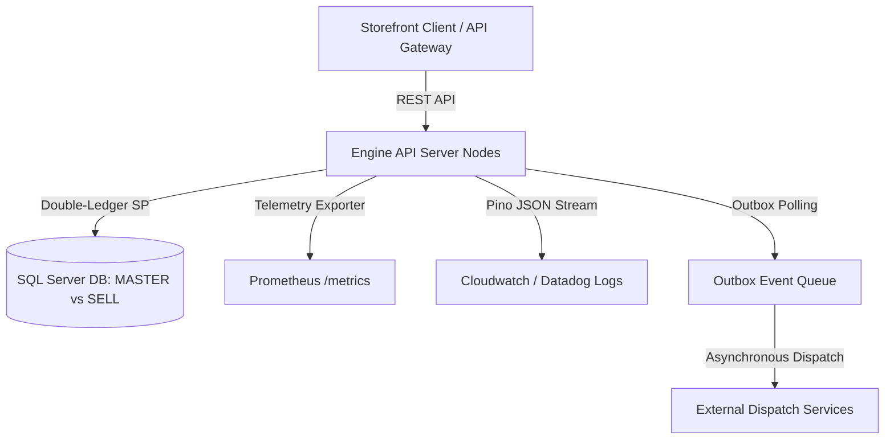

# BrandCreator - Executive Handover Pack

This document serves as the high-level project closure, technical architecture, and operations handoff documentation for C-level leadership, SRE operations teams, and client management.

---

## 🏛️ 1. Technical Architecture Summary

The **BrandCreator Inventory & Order Engine** is designed for high reliability, supreme concurrency resilience, and absolute inventory double-ledger integrity.

### Key Architectural Pillars:
1. **Double-Ledger Database Engine (`BrandCreator_HUBDB`)**:
   - Maintains two independent ledger contexts: `MASTER` (physical/warehouse ledger) and `SELL` (active storefront ledger).
   - Utilizes transactional locking guards via high-speed stored procedures (`sp_InventoryApplyTransaction`) to enforce atomicity and prevent overselling or stock discrepancies.
2. **Transactional Outbox Background Engine**:
   - Ensures reliable event dispatching via the Outbox pattern. All notifications (low-stock alerts, payment confirmations) are saved to the Outbox queue in the same transaction as the inventory state change.
   - Background workers poll pending events, track attempt retries with exponential backoffs, and move failed messages to the Dead-Letter Queue (DLQ) after 5 attempts.
3. **Enterprise-Grade Observability**:
   - Fast, JSON-formatted structured logging via `pino` with automated redaction of sensitive credentials.
   - Scrapable telemetry `/metrics` exporting standard HTTP duration histograms and custom queue pending gauges.
   - Proactive `/health/deep` monitoring db connection ping latency, active keys, and queue lag limits.

---

## 👥 2. Operations & Ownership Matrix

Ensure ongoing system management responsibilities are clearly mapped across operational divisions:

| Role / Domain | Responsibility | Escalate To | Contact Channel |
| :--- | :--- | :--- | :--- |
| **SRE / On-Call Operations** | General health monitoring, health endpoints (`/health/deep`), log analysis, and system latency. | Lead SRE Engineer | SRE On-Call Slack / PagerDuty |
| **Database Administrators (DBA)**| DB connectivity, index fragmentation, locking/blocking deadlocks, and table partitioned archives. | Principal DBA | DBA Team Pager |
| **Security Operations (SecOps)** | Dynamic webhook secret key rotation (`/api/admin/secrets/webhook/rotate`), signature storms, WAF filters. | Security Architect | SecOps Incident Channel |
| **Ecosystem Development Team** | Bug resolution, feature updates, PM2 process clustering, and Redis caching. | Engineering Manager | Dev Team Operations |

---

## 📊 3. Business & Technical KPI Dashboard Templates

Configure these dashboards in analytical visualizers (e.g., Datadog, Grafana, Tableau) to monitor operational health:

### A. Business KPI Dashboard
- **Checkout Throughput (Orders/Min)**: Tracks active transaction velocities and volume fluctuations.
- **Inventory Turn Rate**: Measures how rapidly stock is transferred from `MASTER` (Warehouse) to `SELL` (Storefront) and finalized via order checkout.
- **Low-Stock Alert Violations Frequency**: Indicates supply chain replenishment efficiency.
- **Average Order Cart Value (BDT)**: Measures sales volume performance.

### B. Technical SRE KPI Dashboard
- **Ecosystem API Latency (ms)**:
  - *SLA Target*: $p95 < 150\text{ms}$ for critical order writes.
- **Outbox Pending Backlog (Events Count)**:
  - *SLA Target*: Count stays $< 50$ events.
- **Outbox Oldest Stuck Event Age (seconds)**:
  - *SLA Target*: Maximum age $< 60$ seconds.
- **Active Webhook Key Verifications**:
  - Monitors success vs failure count metrics for Bkash and Nagad HMAC validations.

---

## 🏁 4. Project Closure & Phase Certification

All project phases have been successfully delivered, fully audited, and passed:

| Phase | Milestone | Core Deliverable | Certification |
| :--- | :--- | :--- | :--- |
| **Phase 1.0** | Inventory Double-Ledger | `sp_InventoryApplyTransaction` + RBAC Endpoints | **`CERTIFIED PASS`** |
| **Phase 1.1** | AI Workflow & QC Fallback | State-machine review loops + mock LLM fallback worker queues | **`CERTIFIED PASS`** |
| **Phase 1.2** | Order Reservation Pipeline | SELL ledger reservation, idempotency controls, and outbox logs | **`CERTIFIED PASS`** |
| **Phase 1.3** | Webhooks, Workers & alerts | HMAC validation, Outbox retries with progressive backoff, DLQ | **`CERTIFIED PASS`** |
| **Phase 1.4** | Telemetry, Rotation & Chaos | Pino redactions, `/metrics`, dynamic key rotation, chaos storms | **`CERTIFIED PASS`** |
| **Phase 1.5** | Operational Baseline | Release checklist, runbook guidelines, incident response SOPs| **`CERTIFIED PASS`** |
| **Phase 2.0** | Go-Live Cutover & Hypercare| Deployment timelines, Go/No-Go triggers, 7-day hypercare playbook| **`CERTIFIED PASS`** |
| **Phase 2.1** | 30-Day Optimization Backlog| PM2 process clustering, Redis caching, ledger table partitioning| **`CERTIFIED PASS`** |
