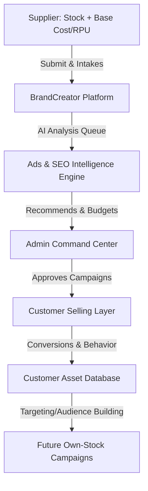

# BrandCreator Ecosystem: Final Ads Engine Master Plan
**Strategic Document: Marketing Intelligence Engine with Controlled Selling Platform**

---

## 1. Business & Strategic Philosophy

### Ads Engine First, Selling Platform Second
Never treat BrandCreator as a conventional "e-commerce marketplace with ads". Instead, the platform is architected as:
> **An ads/marketing intelligence engine that hosts a highly controlled internal selling channel.**

The core asset of BrandCreator is **audience intelligence, algorithmic product validation, ad-spend arbitrage, and localized search optimization (SEO) data**. The inventory and transaction flow exists to fund, validate, and train this intelligence engine, establishing an audience base for future proprietary stock campaigns.



---

## 2. Full Business & Financial Model

### Core Revenue Model
BrandCreator operates on a cost-plus commission model where the Admin acts as the merchant of record and campaign director.

$$\text{Final Selling Price} = \text{Supplier Price (RPU/MRP)} + \text{Marketing Cost} + \text{Platform Commission} + \text{Delivery/Ops Cost}$$

### Financial Split & Ledger Logic
When an order settles:
1. **Gross Revenue:** Realized customer payment.
2. **Supplier Payable:** Supplier's wholesale price (RPU/MRP).
3. **Ad Spend Recovery:** Recovers simulated or actual marketing expense allocated to the product/campaign.
4. **Ops Cost Recovery:** Standard shipping and processing overhead.
5. **Platform Commission:** BrandCreator service charge.
6. **Net BrandCreator Profit:** Residual margin ($\text{Gross} - \text{Supplier} - \text{Ad Spend} - \text{Ops} - \text{Commission}$).
7. **Profit After Return/Refund:** Adjusted dynamically inside the double-entry ledgers based on returns or delivery failures.

---

## 3. Upgraded Supplier Intake Attributes

Suppliers are restricted to catalog upload and basic physical warehouse dispatch tracking. The following updated fields must be supported:

| Category | Attribute | Database Type | Description |
|---|---|---|---|
| **Identity** | `SKU` | `NVARCHAR(100)` | Unique Stock Keeping Unit identifier (Unique Constraint) |
| | `Barcode` | `NVARCHAR(100)` | Standard product GTIN/EAN barcode |
| | `ProductName` | `NVARCHAR(255)` | Public display name of product |
| | `Category` | `NVARCHAR(100)` | Taxonomy group (e.g. Apparel, Electronics) |
| | `Brand` | `NVARCHAR(100)` | Manufacturer/Creator brand identifier |
| **Media** | `ProductImages` | `NVARCHAR(MAX)` | JSON string mapping paths/URLs of uploads |
| **Financials**| `RPU_MRP` | `DECIMAL(18,2)` | Base supplier cost (wholesale payable) |
| | `SuggestedRetailPrice` | `DECIMAL(18,2)` | Supplier's suggested retail price (optional reference) |
| | `CostNote` | `NVARCHAR(500)` | Secret notes about manufacturing or discount tiers |
| **Logistics** | `StockQty` | `INT` | Initial physical intake batch count |
| | `Variants` | `NVARCHAR(MAX)` | JSON mapping sizes, colors, or materials |
| | `SupplierLocation` | `NVARCHAR(255)` | Geographic dispatch warehouse location |
| | `DeliveryCoverage` | `NVARCHAR(500)` | Allowed delivery boundaries |
| | `SupplierNotes` | `NVARCHAR(1000)` | Private admin-facing manufacturing remarks |
| | `OnlineSellingRequest`| `BIT` | Boolean flag requesting placement onto virtual channel |

---

## 4. Admin Command Center Tab Architecture

The Admin Dashboard acts as the primary executive center divided into 13 tabs/modules:

1. **Supplier Product Intake:** Inspect supplier applications and physical batch check-ins.
2. **Product QC:** Approve/Reject raw products. Approved items are automatically registered to the AI intelligence analyzer.
3. **Stock Control:** Dynamic double-ledger monitor (Physical MASTER vs. Virtual SELL). Lock, adjust, or reconcile accounts.
4. **Ads Intelligence:** View AI-generated target platform performance scores, creative requirements, and CPC forecasts.
5. **SEO Intelligence:** Review AI-generated localized tags, Bengali meta descriptions, and Google Search priority keywords.
6. **Location Targeting:** Inspect regional heatmaps across standard districts to deploy ad budget.
7. **Pricing & Profit:** Configure profit plans. Set final selling price by adding commission, marketing budget caps, and logistics buffers.
8. **Orders & Payment Success:** Manage customer purchases. Track payment verification status (`PAYMENT_VERIFIED` or explicit manual review override notes) before confirming delivery.
9. **Returns:** Handle reverse-logistics pipelines. Adjust double-entry ledgers automatically upon return settlements.
10. **Reviews:** Moderate customer comments and qualitative sentiment metrics.
11. **Customer List/Background:** View and edit customer profiles, purchase history, and reliability index.
12. **Campaign Performance:** Analyze real-time ROAS (Return on Ad Spend), actual spend, and CPA.
13. **Future Own-Stock Audience:** Segment audience profiles built from 3rd party supply data for direct marketing campaigns.

---

## 5. Background AI Engine Lifecycle & Freshness

### Triggers
The background analyzer runs asynchronously on a standard interval or is triggered immediately when:
* A new product is added/QC-Approved.
* New stock batches are added to MASTER.
* Virtual SELL stock levels shift.
* Customer orders are verified/refunded.
* Admin triggers manual "Sync Data".

### Job Lifecycle State Machine

```text
       [QUEUED] 
          │
          ▼
     [ANALYZING] ────► [NEEDS_DATA] (Missing barcodes, images, etc.)
          │
          ▼
       [READY] ◄────────┐
          │             │
          ▼             │
   (Data Changed)       │
          │             │
          ▼             │
       [STALE] ─────────┤
          │             │
          ▼             │
      [OUTDATED] ───────┘
          │
          ▼
       [FAILED]
```

* `QUEUED`: Analysis request initialized.
* `ANALYZING`: AI worker currently processing metadata, competitor keywords, and regional scores.
* `NEEDS_DATA`: Blocked; supplier must add higher quality images, proper barcodes, or categories.
* `READY`: Strategy package complete; recommendations are ready for Admin approval.
* `STALE`: Analysis is over 1 hour old; requires refreshing.
* `OUTDATED`: Stock counts, prices, or categories changed after analysis completed. Re-trigger required.
* `FAILED`: Error in prompt execution or model unavailability.
* `APPROVED_BY_ADMIN`: Recommendations committed. Selling channel updated.
* `REJECTED_BY_ADMIN`: Rejected. Admin enters custom manual parameters.

### Data Freshness SLA
* **LIVE:** Performance data, conversion logs, and stock levels are updated under 5 minutes.
* **FRESH:** Standard recommendations are rebuilt under 30 minutes.
* **STALE:** Recommendations older than 1 hour are marked for low-priority background rebuilds.
* **OUTDATED:** System immediately flags recommendations as outdated if a price, category, or core logistic constraint changes.

---

## 6. AI Intelligence Outputs

The engine generates the following core variables for every analyzed product:

* **Product Readiness Score:** 1-100 rating based on listing quality (images, unique SKU, barcode, descriptions).
* **Missing Data Warnings:** Checklist of parameters needed to maximize campaign viability.
* **Best Selling Locations:** Ranked list of target geographic zones in Bangladesh.
* **Best Ad Platforms:** Score matching TikTok, Reels, Facebook, Google, etc.
* **Suggested Ad Budget:** Initial daily cap recommended for testing.
* **Suggested Final Selling Price:** Price point maximizing conversion vs. ROAS margin.
* **Estimated Reach/Clicks/Orders:** Projection matrix.
* **Expected ROAS:** Estimated Return on Ad Spend.
* **Expected BrandCreator Profit:** Forecasted net platform profit.
* **SEO local suggestions:** Title, meta tags, and description.
* **Risk Level:** Risk rating based on return history of product type or supplier location.
* **Reasoning:** Dual-language summary output (English & Bengali) explainable to the admin.

---

## 7. Localized Geographic Intelligence

Geographic scoring focuses initially on Bangladesh regions, expanding districts dynamically:

1. **Dhaka** (High demand, fast delivery, low return risk).
2. **Chittagong** (High purchase power, moderate logistics cost).
3. **Sylhet** (High average order value, luxury preference).
4. **Rajshahi** (Emerging, high price sensitivity).
5. **Khulna** (Moderate demand).
6. **Narayanganj & Gazipur** (Industrial hubs, rapid cash-on-delivery turnaround).

### Scoring Matrix Parameters
$$\text{Geographic Score} = f(\text{Demand Fit}, \text{Delivery Feasibility}, \text{Price Fit}, \text{Audience Density}, \text{Stock Capacity}, \text{Past Conversions}, \text{Return Risk})$$

---

## 8. Platform Channel Suitability

The engine assigns suitability scores (1-100) and CPC estimates across major channels:

* **Facebook/Instagram:** Visual feed optimization, high audience density, medium CPC, high retargeting asset build.
* **TikTok/Reels:** Short video creatives, impulsive buying segments, low CPC, high conversion rate for apparel/beauty.
* **Google Search:** High intent, high CPC, best for utilities/appliances with clear barcodes and active search queries.
* **YouTube:** Long-form reviews/sponsorships, high initial cost, high brand trust.
* **Local Social Groups:** Community marketing, zero direct ad-spend, high manual ops.
* **Future Marketplace Channels:** API syndication channels (Daraz, etc.).

---

## 9. Platform Profit Engine Formula

Every transaction is mapped inside the Double-Entry Ledger System:

```text
[Customer Payment (Gross Revenue)]
  ├── (Supplier Cost / RPU) ──► Paid to Supplier
  ├── (Actual Paid Marketing) ──► Recovers Ad Spend
  ├── (Ops & Delivery Cost) ──► Recovers Shipping Overhead
  └── [Residual Balance] 
        ├── (Platform Service Charge) ──► Commission Account
        └── [Net BrandCreator Profit] ──► Retained BrandCreator Earnings
```

### Double Ledger Reconciliations
* **Refund/Return Adjustments:** If an order fails or is returned, the double-entry accounts debit the Platform Profit and Supplier Payable columns, reflecting actual final payouts accurately.

---

## 10. Customer Asset Database Strategy

The primary long-term asset of BrandCreator is the proprietary **Customer Profile Registry**. Suppliers do not get direct access to customer listings. The platform monitors:

* **Profile ID:** Immutable, unique hash.
* **Demographics:** Verified mobile number, email, and target shipping address.
* **Reliability Index:** Order count vs. Return count (automatically flags high return-risk customers).
* **Affluence Score:** Average Order Value (AOV) and category preferences.
* **Cohort Segment:** Tags for dynamic retargeting (e.g. *dhaka-apparel-buyer*, *high-aov-sylhet*).
* **Future Own-Stock Targeting Potential:** Opt-in records and pixel cookies to run hyper-targeted campaigns for BrandCreator's future proprietary stock.

---

## 11. SQL Schema Architecture Proposal

```sql
-- 1. Upgraded Supplier Attributes Table
CREATE TABLE dbo.ProductExtendedAttributes (
    ProductId INT PRIMARY KEY FOREIGN KEY REFERENCES dbo.Products(ProductId),
    Barcode NVARCHAR(100) NULL,
    Brand NVARCHAR(100) NULL,
    Category NVARCHAR(100) NULL,
    RPU_MRP DECIMAL(18,2) NOT NULL DEFAULT 0.00,
    SuggestedRetailPrice DECIMAL(18,2) NULL,
    CostNote NVARCHAR(500) NULL,
    VariantsJson NVARCHAR(MAX) NULL, -- JSON mapping sizes, colors
    SupplierLocation NVARCHAR(255) NULL,
    DeliveryCoverage NVARCHAR(500) NULL,
    OnlineSellingRequested BIT NOT NULL DEFAULT 0,
    UpdatedAt DATETIME2 NOT NULL DEFAULT SYSUTCDATETIME()
);

-- 2. Dedicated Multi-Image Table
CREATE TABLE dbo.ProductImages (
    ImageId INT IDENTITY(1,1) PRIMARY KEY,
    ProductId INT FOREIGN KEY REFERENCES dbo.Products(ProductId),
    ImageUrl NVARCHAR(500) NOT NULL,
    SortOrder INT NOT NULL DEFAULT 0,
    CreatedAt DATETIME2 NOT NULL DEFAULT SYSUTCDATETIME()
);

-- 3. Supplier Stock Batch Tracker
CREATE TABLE dbo.SupplierStockBatches (
    BatchId INT IDENTITY(1,1) PRIMARY KEY,
    ProductId INT FOREIGN KEY REFERENCES dbo.Products(ProductId),
    IntakeQty INT NOT NULL,
    RemainingQty INT NOT NULL,
    CostPerUnit DECIMAL(18,2) NOT NULL,
    ReceivedAt DATETIME2 NOT NULL DEFAULT SYSUTCDATETIME(),
    ReceivedByEmail NVARCHAR(255) NOT NULL
);

-- 4. Admin Pricing Engine Configurations
CREATE TABLE dbo.AdminPricingPlans (
    PlanId INT IDENTITY(1,1) PRIMARY KEY,
    ProductId INT UNIQUE FOREIGN KEY REFERENCES dbo.Products(ProductId),
    FinalRetailPrice DECIMAL(18,2) NOT NULL,
    MarketingAllocationCap DECIMAL(18,2) NOT NULL DEFAULT 0.00,
    DeliveryChargeBase DECIMAL(18,2) NOT NULL DEFAULT 0.00,
    CommissionRate DECIMAL(5,2) NOT NULL DEFAULT 0.00,
    IsActive BIT NOT NULL DEFAULT 1,
    CreatedByEmail NVARCHAR(255) NOT NULL,
    UpdatedAt DATETIME2 NOT NULL DEFAULT SYSUTCDATETIME()
);

-- 5. AI Marketing Recommendation Snapshots
CREATE TABLE dbo.MarketingAnalysisJobs (
    JobId BIGINT IDENTITY(1,1) PRIMARY KEY,
    ProductId INT FOREIGN KEY REFERENCES dbo.Products(ProductId),
    Status VARCHAR(30) NOT NULL DEFAULT 'QUEUED', -- QUEUED, ANALYZING, NEEDS_DATA, READY, FAILED
    ErrorMessage NVARCHAR(1000) NULL,
    CreatedAt DATETIME2 NOT NULL DEFAULT SYSUTCDATETIME(),
    FinishedAt DATETIME2 NULL
);

CREATE TABLE dbo.MarketingRecommendationSnapshots (
    SnapshotId INT IDENTITY(1,1) PRIMARY KEY,
    ProductId INT FOREIGN KEY REFERENCES dbo.Products(ProductId),
    JobId BIGINT FOREIGN KEY REFERENCES dbo.MarketingAnalysisJobs(JobId),
    ReadinessScore INT NOT NULL DEFAULT 0,
    SuggestedRetailPrice DECIMAL(18,2) NULL,
    SuggestedDailyBudget DECIMAL(18,2) NULL,
    ExpectedROAS DECIMAL(5,2) NULL,
    ExpectedNetProfit DECIMAL(18,2) NULL,
    SEOKeywords NVARCHAR(1000) NULL,
    SEOMetaDescription NVARCHAR(1000) NULL,
    BanglaReasoning NVARCHAR(2000) NULL,
    EnglishReasoning NVARCHAR(2000) NULL,
    IsApplied BIT NOT NULL DEFAULT 0,
    CreatedAt DATETIME2 NOT NULL DEFAULT SYSUTCDATETIME()
);

CREATE TABLE dbo.LocationTargetScores (
    ScoreId INT IDENTITY(1,1) PRIMARY KEY,
    SnapshotId INT FOREIGN KEY REFERENCES dbo.MarketingRecommendationSnapshots(SnapshotId),
    DistrictName NVARCHAR(100) NOT NULL,
    Score INT NOT NULL,
    AdBudgetAllocation DECIMAL(5,2) NOT NULL DEFAULT 0.00,
    CreatedAt DATETIME2 NOT NULL DEFAULT SYSUTCDATETIME()
);

CREATE TABLE dbo.PlatformRecommendationScores (
    ScoreId INT IDENTITY(1,1) PRIMARY KEY,
    SnapshotId INT FOREIGN KEY REFERENCES dbo.MarketingRecommendationSnapshots(SnapshotId),
    PlatformName VARCHAR(50) NOT NULL, -- Facebook, TikTok, Google, etc.
    SuitabilityScore INT NOT NULL,
    EstimatedCPC DECIMAL(18,2) NULL,
    RecommendedDailyBudget DECIMAL(18,2) NULL,
    CreatedAt DATETIME2 NOT NULL DEFAULT SYSUTCDATETIME()
);

-- 6. Ad Spend Ledger (Actual vs. Forecast)
CREATE TABLE dbo.AdsBudgetLedgers (
    LedgerId INT IDENTITY(1,1) PRIMARY KEY,
    ProductId INT FOREIGN KEY REFERENCES dbo.Products(ProductId),
    CampaignName NVARCHAR(255) NOT NULL,
    PlatformName VARCHAR(50) NOT NULL,
    AllocatedAmount DECIMAL(18,2) NOT NULL DEFAULT 0.00,
    SpentAmount DECIMAL(18,2) NOT NULL DEFAULT 0.00,
    ConversionsCount INT NOT NULL DEFAULT 0,
    StartDate DATETIME2 NOT NULL,
    EndDate DATETIME2 NULL,
    CreatedAt DATETIME2 NOT NULL DEFAULT SYSUTCDATETIME()
);

-- 7. Platform Ledger Profit breakdowns
CREATE TABLE dbo.OrderProfitBreakdowns (
    OrderId INT PRIMARY KEY FOREIGN KEY REFERENCES dbo.Orders(OrderId),
    SupplierPriceTotal DECIMAL(18,2) NOT NULL,
    AdSpendAllocated DECIMAL(18,2) NOT NULL,
    DeliveryCostActual DECIMAL(18,2) NOT NULL,
    CommissionEarned DECIMAL(18,2) NOT NULL,
    NetPlatformProfit DECIMAL(18,2) NOT NULL,
    SettlementStatus VARCHAR(50) NOT NULL DEFAULT 'PENDING',
    SettledAt DATETIME2 NULL
);

-- 8. Customer Profile Registers
CREATE TABLE dbo.CustomerProfiles (
    CustomerId INT IDENTITY(1,1) PRIMARY KEY,
    UserEmail NVARCHAR(255) UNIQUE NOT NULL,
    DisplayName NVARCHAR(255) NULL,
    PhoneNumber VARCHAR(30) NULL,
    PrimaryLocation NVARCHAR(255) NULL,
    ReliabilityIndex INT NOT NULL DEFAULT 100, -- subtracts points on return/failures
    CreatedAt DATETIME2 NOT NULL DEFAULT SYSUTCDATETIME()
);

CREATE TABLE dbo.CustomerOrderSummaries (
    CustomerId INT PRIMARY KEY FOREIGN KEY REFERENCES dbo.CustomerProfiles(CustomerId),
    TotalOrdersCount INT NOT NULL DEFAULT 0,
    SuccessfulPaymentsCount INT NOT NULL DEFAULT 0,
    ReturnsCount INT NOT NULL DEFAULT 0,
    AOV DECIMAL(18,2) NOT NULL DEFAULT 0.00,
    LastOrderAt DATETIME2 NULL
);
```

---

## 12. Backend API Roadmap

### Supplier Endpoints
* `POST /api/supplier/products`: Register base product with complete intake parameters.
* `POST /api/supplier/products/:id/images`: Upload image file or specify external image URL.
* `POST /api/supplier/products/:id/stock`: Register a physical stock intake batch onto MASTER ledger.
* `GET /api/supplier/products`: View supplier-owned catalog, status, and physical stock logs.

### Admin Endpoints
* `GET /api/admin/business-overview`: Dynamic ledger totals, aggregate profit splits, active ROAS tracking.
* `GET /api/admin/product-intake`: View supplier product applications queue.
* `POST /api/admin/products/:id/qc/approve`: Run QC audit check. Activates product and queues it for the AI Analysis engine.
* `POST /api/admin/products/:id/pricing-plan`: Set commission rates, marketing budget caps, and final selling prices.
* `POST /api/admin/products/:id/marketing-sync`: Manually trigger background AI re-analysis job.
* `GET /api/admin/products/:id/marketing-recommendation`: Retrieve computed scores, best channels, district ratios, and Dual-Language reasoning.
* `POST /api/admin/marketing/:id/approve`: Admin approves recommended campaign options and locks target budgets.
* `GET /api/admin/profit-ledger`: Review double-entry accounting ledgers and settlement payouts.
* `GET /api/admin/customers`: Retrieve localized customer profiles and affluence segments.
* `GET /api/admin/returns`: Oversee active return claims and adjustments.

### Customer Storefront Endpoints
* `GET /api/shop/products`: Lists products. The UI displays custom supplier images and prioritizes `RetailPrice` dynamically.
* `POST /api/orders`: Submit checkout options. Automatically initializes payment verification layer.
* `GET /api/orders/my`: Retrieve purchase histories and delivery states.

---

## 13. Frontend UI Upgrades Layout

### Supplier Dashboard
* **Forms:** Clean grid including barcode input, image URL arrays, category selector, brand, RPU input, variants (sizes, colors), and stock deposit quantities.
* **Tables:** List products showing RPU, category, and a small thumbnail of the custom upload.

### Admin Dashboard (The Brand Center Command Panel)
* **Intelligence View:** Multi-layered dashboard demonstrating active campaigns, regional Heatmaps of Bangladesh districts, expected ROAS gauges, and CPC estimations.
* **Pricing Plan Panel:** Interactive sliders allowing admins to slide from Supplier price through marketing costs, commission tiers, and delivery charges to visualize the target profit margin before deploying the product live.

### Customer Shop
* **Storefront Grid:** A visual catalog featuring high-quality customized product images, organized tag filters (Category/Brand), and direct Checkout reservation interfaces.

---

## 14. Safety & Operational Guardrails

1. **Budget Cap Lock:** The Admin Pricing Engine enforces a mandatory `MarketingAllocationCap`. The automated system cannot deploy ad budget exceeding this cap without explicit manual authentication.
2. **Double-Entry Safeguard:** Payouts to suppliers are strictly calculated from actual cash settlements. Standard commissions or profits are locked until the matching order's payment status transitions to `PAYMENT_VERIFIED`.
3. **Information Asymmetry:** Raw supplier interfaces are completely blinded to admin retail pricing plans, commission structures, actual ad spend details, and net platform profit metrics.
4. **Offline Gateway Webhook Mocking:** To allow testing without live accounts, payment verification uses a strict cryptographic sandbox that mimics gateway webhook structures locally.

---

## 15. Phased Implementation Strategy

```text
  PHASE 1: Product Intake & Schema Upgrade 
    │ (Upgrade supplier intake inputs, database schema tables, and basic tables)
    ▼
  PHASE 2: Admin Pricing & Ledger Integration 
    │ (Implement profit plans and double-entry split ledger accounting)
    ▼
  PHASE 3: Background AI Strategy Engine 
    │ (Develop async analysis jobs and integrate Gemini API for strategy forecasts)
    ▼
  PHASE 4: Admin Command Dashboard 
    │ (Deploy regional heatmap tables, channel score grids, and pricing sliders)
    ▼
  PHASE 5: Profit Settlement Layer 
    │ (Connect payment verification webhook sandboxes and finalize net margins)
    ▼
  PHASE 6: Return, Review & Customer Registry 
    │ (Incorporate customer profiles, reliability scores, and return settlement hooks)
    ▼
  PHASE 7 & 8: Real Marketing API Syndication & Retargeting 
    │ (Synchronize Google Search and Facebook Pixel triggers with customer cohorts)
```

---

## 16. First Coding Task: Intake Schema & Endpoint Upgrades

We will begin execution by upgrading the supplier product intake layer:

1. **SQL Schema Extension:** Execute `migration_008_product_intake.sql` to add Extended Attributes and Image databases to the catalog.
2. **API Controller Logic:** Modify `createProduct`, `getProducts`, and details mappers in `inventoryController.js` to process and return these attributes.
3. **Supplier Form Upgrade:** Modify `SupplierDashboard.jsx` to support the advanced glassmorphism input forms for complete catalog entry.
