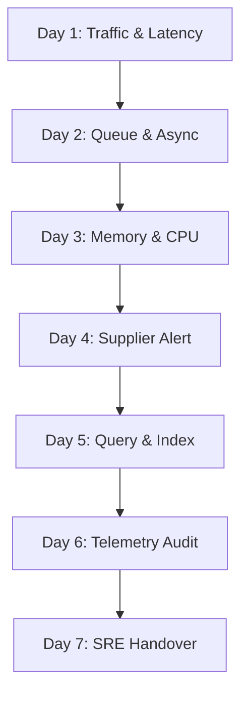

# BrandCreator - 7-Day Production Hypercare Playbook

Hypercare represents the elevated support period immediately following the production launch of the **BrandCreator Inventory & Order Engine**. This playbook structures the post-launch stabilization checks to ensure system performance, data integrity, and operational robustness.

---

## 📅 1. Hypercare Schedule and Day-by-Day Focus

The SRE and development team will perform targeted daily verification routines for the first 7 days post-launch:

### Day 1: Connection & Traffic Stabilisation
- **Focus**: Monitor HTTP status distributions and API connection pools under real customer load.
- **Tasks**:
  - Verify that the HTTP 200/201 success rate across `/api/orders` and `/api/webhooks/payment/:provider` is $> 99.5\%$.
  - Monitor `/health/deep` every 30 minutes for database ping spikes (`dbMs > 150ms`).
  - Audit database connection pool utilization in SQL Server to ensure thread exhaustion is avoided.

### Day 2: Queue & Async Processing Verification
- **Focus**: Validate Outbox background workers and asynchronous transaction processing pipelines.
- **Tasks**:
  - Monitor `bc_outbox_pending_events` metrics. Check that the outbox worker polls and delivers events within SLA ($< 5\text{ seconds}$).
  - Query `dbo.OutboxAttempts` for failed delivery trends and remediate network routing or schema mismatches.
  - Confirm that no critical events are transitioning to `'DEAD_LETTER'` without immediate triage.

### Day 3: Memory & Resource Leak Profiling
- **Focus**: Monitor Node.js process CPU, memory footprint, and heap stability under continuous traffic.
- **Tasks**:
  - Profile process heap usage. Confirm that memory usage stabilizes (no progressive upward sloped memory leaks).
  - Check container CPU allocations. Verify that engine processes do not experience throttling during traffic spikes.
  - Review garbage collection frequency and latency metrics in APM dashboards.

### Day 4: Supplier Ownership & Stock Alert Audit
- **Focus**: Ensure security filters, low-stock automated policies, and row-level access permissions execute correctly.
- **Tasks**:
  - Run checks to verify that suppliers can access *only* their owned products. Confirm that unauthorized requests are blocked with `403 FORBIDDEN`.
  - Validate low-stock rule triggers against `dbo.ProductStockPolicies`.
  - Check that the low-stock alert dashboard exposes alerts matching active inventory levels.

### Day 5: Performance & Index Performance Check
- **Focus**: Performance audit of hot queries, database query execution plans, and index page splits.
- **Tasks**:
  - Review the slow-query logs in the Pino structured logs stream (query times exceeding the 200ms threshold).
  - Verify index scan vs index seek ratios for `dbo.InventoryLedgers` and `dbo.OutboxEvents`.
  - Re-verify index fragmentation states on hot tables and rebuild if fragmentation exceeds 30%.

### Day 6: Telemetry & Logging Cleanliness
- **Focus**: Cleanliness of logger output streams and correct execution of Prometheus counters.
- **Tasks**:
  - Inspect Pino structured JSON log streams. Ensure zero sensitive credential variables leak into the logs.
  - Confirm that Prometheus metrics `/metrics` successfully exports clean exposition metrics.
  - Resolve any persistent warnings or non-critical error spikes in the application logs.

### Day 7: Sign-Off and Operations Handover
- **Focus**: Hypercare sign-off and transition of operational ownership to standard DevOps/SRE support.
- **Tasks**:
  - Compile the 7-Day stabilization metrics report.
  - Verify that the Operations Runbook and Incident Response Playbooks are up-to-date and accessible by the support team.
  - Conduct standard operations handover walkthrough sessions.

---

## 🚨 2. Incident Escalation Matrix

During the hypercare period, SREs will use this priority tiering for fast incident resolution:

| Priority | Criteria | SLA Response | Primary Handler | Escalation path |
| :--- | :--- | :--- | :--- | :--- |
| **P1** | Core ecosystem down; orders failing; stock leaks or double-ledger discrepancies. | **15 Minutes** | On-Call Lead SRE | VP of Engineering |
| **P2** | Webhook verification failing; outbox queue latency $> 10\text{ minutes}$; supplier portal access degraded. | **60 Minutes** | Backend Engineer | On-Call Lead SRE |
| **P3** | Low-stock policy configuration failures; slow response times ($> 500\text{ms}$ but $< 2000\text{ms}$). | **4 Hours** | Support Engineer | Backend Engineer |

---

## 🏁 3. Hypercare Exit Criteria

To successfully exit Hypercare and transition to standard maintenance, the system must achieve:

- [ ] **System Availability**: $\ge 99.9\%$ uptime over the 7-day period.
- [ ] **Zero Data Discrepancies**: Reconciliation checks return `"ok": true` and a difference of `0` across all active products.
- [ ] **Zero P1 Incidents**: No unresolved high-priority incidents in the tracking backlog.
- [ ] **Low-Latency Standard**: 95th percentile HTTP response latencies stay $< 150\text{ms}$ for critical inventory and ordering endpoints.
- [ ] **Complete Handover**: Runbook and playbook walkthrough sessions completed for the operations team.
