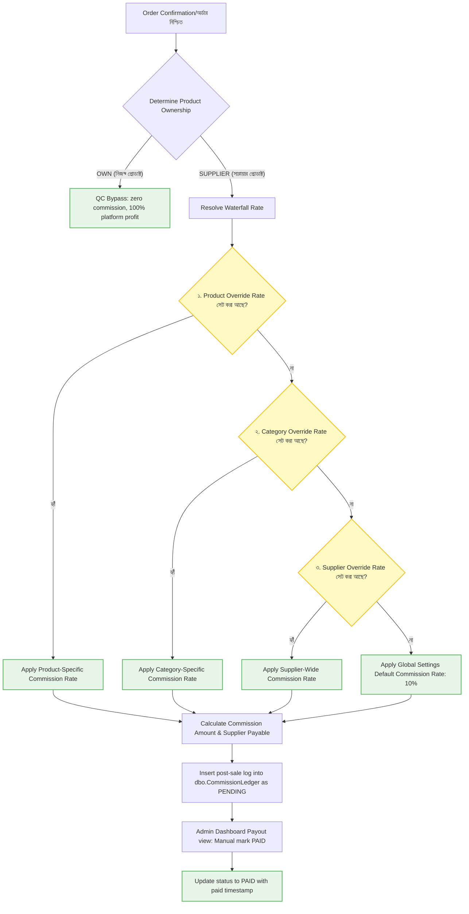

# BrandCreator Ecosystem — পূর্ণাঙ্গ অপারেশন ম্যানুয়াল

অ্যাডমিন, সাপ্লায়ার এবং কাস্টমার পোর্টালের সমন্বয়ে গঠিত BrandCreator হাইব্রিড ই-commerce প্ল্যাটফর্মের ব্যাকএন্ড কোর ও ফ্রন্টএন্ড ইন্টারফেস সুষ্ঠুভাবে পরিচালনার জন্য এটি একটি ব্যাপক এবং অত্যন্ত ভিজ্যুয়াল হ্যান্ডবুক।

---

## 📊 ১. ওভারভিউ এবং সিস্টেম আর্কিটেকচার ফ্লো

আমাদের সম্পূর্ণ ইকোসিস্টেমের বিভিন্ন মডিউল, ডাটাবেজ এবং ভূমিকা কীভাবে একে অপরের সাথে ইন্টারঅ্যাক্ট করে, তা নিচের ফ্লোচার্টে দেখানো হলো:

```mermaid
graph TD
    %% Styling Definitions
    classDef admin fill:#ffe3e3,stroke:#ff8585,stroke-width:2px;
    classDef supplier fill:#e3f2fd,stroke:#42a5f5,stroke-width:2px;
    classDef customer fill:#e8f5e9,stroke:#66bb6a,stroke-width:2px;
    classDef db fill:#ede7f6,stroke:#7e57c2,stroke-width:2px;
    classDef engine fill:#fff3e0,stroke:#ffb74d,stroke-width:2px;

    %% Nodes
    A[Customer / ক্রেতা] :::customer
    B[Customer Shop / ই-কমার্স শপ] :::customer
    C[Supplier / সরবরাহকারী] :::supplier
    D[Supplier Dashboard] :::supplier
    E[Admin / অ্যাডমিন] :::admin
    F[Admin Dashboard] :::admin
    G[(SQL Server Database)] :::db
    H[Express Backend Engine] :::engine

    %% Connections
    A -->|১. ভিজিট ও শপিং কার্ট| B
    B -->|২. অর্ডার সাবমিট| H
    C -->|৩. প্রোডাক্ট আপলোড ও QC রিকোয়েস্ট| D
    D -->|৪. ইমেজ ও স্টক ডেটা| H
    E -->|৫. QC এপ্রুভাল ও স্টক ট্রান্সফার| F
    F -->|৬. এপ্রুভ ও কনফার্মেশন অ্যাকশন| H
    H -->|৭. ট্রানজেকশনাল রাইট| G
    G -->|৮. ওয়াটারফল কমিশন হিসাব ও লেজার পোস্ট| H
    H -->|৯. কমিশন ডেটা ও পে-আউট হিস্ট্রি| F
    F -->|১০. ম্যানুয়াল পেমেন্ট শেষে Mark Paid| H
```

---

## 📋 সূচিপত্র

1. [সিস্টেম পরিচিতি](#সিস্টেম-পরিচিতি)
2. [সিস্টেম চালু ও বন্ধ করা](#সিস্টেম-चालু-ও-বন্ধ-করা)
3. [অ্যাডমিন অপারেশন ও ড্যাশবোর্ড কন্ট্রোল](#অ্যাডমিন-অপারেশন)
4. [সাপ্লায়ার অপারেশন ও ক্যাটালগ ম্যানেজমেন্ট](#সাপ্লায়ার-অপারেশন)
5. [কাস্টমার অপারেশন ও চেকআউট ফ্লো](#কাস্টমার-অপারেশন)
6. [ইমেজ আপলোড ও অপ্টিমাইজেশন](#ইমেজ-ম্যানেজমেন্ট)
7. [ওয়াটারফল কমিশন ও রেভিনিউ বন্টন](#কমিশন-ও-রেভিনিউ-ম্যানেজমেন্ট)
8. [সিস্টেম ট্রাবলশুটিং গাইড](#ট্রাবলশুটিং)
9. [প্রোডাকশন ডেপ্লয়মেন্ট ম্যানুয়াল](#প্রোডাকশন-ডেপ্লয়মেন্ট)
10. [অপারেশনাল চেকলিস্ট ও টিপস](#চেকলিস্ট)

---

## 🎯 সিস্টেম পরিচিতি

### **BrandCreator Ecosystem কি?**
এটি একটি ডাইনামিক **হাইব্রিড ই-commerce প্ল্যাটফর্ম** যা একই সাথে নিজস্ব উৎপাদিত পণ্য এবং থার্ড-পার্টি সাপ্লায়ারদের পণ্য বিক্রির সুযোগ দেয়।

> [!NOTE]
> **হাইব্রিড মডেলের আয়ের উৎস:**
> - **নিজস্ব পণ্য (OWN Products)**: ১০০% মুনাফা সরাসরি প্ল্যাটফর্মের। কোনো সাপ্লায়ার কমিশন কাটা হয় না।
> - **সাপ্লায়ার পণ্য (SUPPLIER Products)**: সাপ্লায়ারের বেস প্রাইস অক্ষুণ্ণ রেখে বিক্রিত মূল্যের ওপর নির্দিষ্ট হারে (ডিফল্ট ১০%) কমিশন প্ল্যাটফর্ম লাভ করে।

### **প্রধান পোর্টাল ও URL**

| পোর্টাল | অ্যাক্সেস URL | মূল ব্যবহারকারী |
| :--- | :--- | :--- |
| **Admin Dashboard** | `http://localhost:8080/admin` | এডমিন টিম, ইনভেন্টরি ম্যানেজার, অ্যাকাউন্টস |
| **Supplier Dashboard** | `http://localhost:8080/supplier` | নিবন্ধিত পার্টনার ও ভেন্ডরগণ |
| **Customer Shop** | `http://localhost:8080/shop` | সাধারণ ক্রেতা ও কাস্টমার |

### **প্রযুক্তিগত ভিত্তি (Tech Stack)**
- **Frontend**: React + Vite (Dark glassmorphism UI থিম)
- **Backend**: Node.js + Express (Port 5000)
- **Database**: Microsoft SQL Server
- **Authentication**: Google OAuth
- **Hosting**: IIS (Port 8080-এ স্ট্যাটিক ক্লায়েন্ট) + Express API (Port 5000)

---

## 🚀 সিস্টেম চালু ও বন্ধ করা

সিস্টেমটি দ্রুত এবং সহজে পরিচালনার জন্য ডেস্কটপে শর্টকাট স্ক্রিপ্ট তৈরি করা রয়েছে।

### **১. সিস্টেম চালু করা**
* **ডেস্কটপ শর্টকাট**: `BrandCreator - Start` শর্টকাটটিতে ডাবল-ক্লিক করুন। এটি ব্যাকএন্ড এপিআই সার্ভারকে সচল করবে।
* **ম্যানুয়ালি চালু করতে**:
  ```powershell
  cd d:\Workspace\01_Projects\Active\BrandCreator_Ecosystem\bc_engine
  npm start
  ```
* **যাচাইকরণ**: ডেস্কটপের `BrandCreator - Verify` স্ক্রিপ্টটি ডাবল ক্লিক করে রান করুন। সব মডিউলে সবুজ (✅) টিক চিহ্ন দেখালে বুঝবেন সিস্টেম বিক্রির জন্য প্রস্তুত।

### **২. সিস্টেম বন্ধ করা**
* **ডেস্কটপ শর্টকাট**: `BrandCreator - Stop` শর্টকাটটি ডাবল-ক্লিক করুন। এটি ব্যাকএন্ডের নোড প্রসেসগুলোকে নিরাপদে বন্ধ করে দেবে।
* **ম্যানুয়ালি বন্ধ করতে**:
  ```powershell
  taskkill /F /IM node.exe
  ```

---

## 👨‍💼 অ্যাডমিন অপারেশন

এডমিন ড্যাশবোর্ডটি প্ল্যাটফর্মের মূল কন্ট্রোল সেন্টার। এডমিন Google OAuth-এর মাধ্যমে নিরাপদ লগইন করে নিচের ফিচারগুলো পরিচালনা করতে পারেন:

### ড্যাশবোর্ড ট্যাবসমূহ এবং কার্যপ্রণালী

#### **১. Overview Tab**
- রিয়েল-টাইম প্ল্যাটফর্ম সেলস গ্রাফ ও মোট অর্ডার ভলিউম ট্র্যাকিং।
- লো-স্টক অ্যালার্ট এবং সিস্টেমের স্বাস্থ্য সম্পর্কিত তাৎক্ষণিক স্ট্যাটাস।

#### **২. QC Queue Tab**
সাপ্লায়াররা যখন নতুন পণ্য তৈরি করে, তখন মানসম্মত ডিজাইনের স্বার্থে সেগুলো ড্রাফট হিসেবে এডমিনের অনুমোদনের অপেক্ষায় থাকে।
1. **রিভিউ**: আপলোড করা পণ্যের বিবরণ, হাই-রেজোলিউশন ইমেজ ও প্রস্তাবিত মূল্য দেখুন।
2. **Approve Design**: এই বাটনে ক্লিক করলে প্রোডাক্টটি মুহূর্তের মধ্যে `Approved` হয়ে দোকানে কাস্টমারদের জন্য লাইভ হয়ে যাবে।
3. **Reject**: কোনো সংশোধন প্রয়োজন হলে রিজেক্ট বাটনে ক্লিক করে কারণ লিখে দিন।

#### **৩. Stock Transfers Tab**
সাপ্লায়ার সরাসরি শপের সেলস ফ্লোর বা শো-রুমে কোনো স্টক পাঠাতে পারে না। সাপ্লায়ার প্রথমে স্টক গোডাউন (MASTER) এন্ট্রি দেয় এবং বিক্রির জন্য স্থানান্তরের অনুরোধ পাঠায়।
1. এডমিন এই ট্যাবে পেন্ডিং স্টক ট্রান্সফারের তালিকা দেখতে পাবেন।
2. ভেরিফাই শেষে `Approve` বাটনে ক্লিক করলে স্টকটি SELL লেজারে স্থানান্তরিত হবে এবং ক্রেতারা পণ্যটি কিনতে পারবেন।

#### **৪. Recent Orders Tab**
কাস্টমারের অর্ডার এবং পেমেন্ট ভেরিফিকেশন ম্যানেজমেন্ট:
1. কাস্টমার যখন পেমেন্ট স্লিপ সাবমিট করে, সেটি PENDING অর্ডার হিসেবে এখানে দেখায়।
2. **Confirm Payment (Dev)** বা ম্যানুয়াল এপ্রুভাল বাটনে ক্লিক করলে ব্যাকএন্ড কমিশন ডিস্ট্রিবিউশন প্রসেস সচল করে এবং স্টক ডেডিকেটেড রিজার্ভড থেকে স্থায়ীভাবে সোল্ড (Sold) হিসেবে রেকর্ড করে।

#### **৫. Revenue Dashboard Tab** `⭐ নতুন`
platform-এর নিজস্ব আয়ের সম্পূর্ণ চিত্র এবং ডাইনামিক গ্রাফিক্যাল পারফরম্যান্স অ্যানালিটিক্স:
- **Direct Sales (OWN Products)**: নিজস্ব ক্যাটালগ বিক্রি থেকে আসা মোট লাভ (১০০%)।
- **Commission Sales**: সাপ্লায়ারদের পণ্য বিক্রি থেকে অর্জিত নির্দিষ্ট কমিশনের পরিমাণ (১০%)।
- **Top Suppliers & Products**: কোন পার্টনার বেশি সেলস এনে দিচ্ছে তার পাই-চার্ট ও রিয়েল-টাইম গ্রিড।

#### **৬. Commission Management Tab** `⭐ নতুন`
সাপ্লায়ারদের পাওনা মিটিয়ে দেওয়ার সেন্ট্রাল ইন্টারফেস:
- **Pending Commissions**: অর্ডারের পেমেন্ট নিশ্চিত হওয়ার পর স্বয়ংক্রিয়ভাবে সাপ্লায়ারের কমিশন এখানে জমা হয়।
- **Mark Paid**: সাপ্লায়ারকে ব্যাংক ট্র্যান্সফার, বিকাশ বা নগদে ম্যানুয়ালি টাকা পাঠানোর পর এডমিন `Mark Paid` বাটনে ক্লিক করবেন। এটি কমিশনের বর্তমান অবস্থা `PAID` করবে এবং পে-আউটের তারিখ ও সময় ডাটাবেজে স্থায়ীভাবে লক করে দেবে।

---

## 🏭 সাপ্লায়ার অপারেশন

প্ল্যাটফর্মের নিবন্ধিত পার্টনার বা ভেন্ডররা নিজস্ব ড্যাশবোর্ড ব্যবহার করে তাদের পণ্য এবং সেলস ট্র্যাক করতে পারেন।

### ড্যাশবোর্ড ট্যাবসমূহ এবং কার্যপ্রণালী

#### **১. Products Tab (নতুন প্রোডাক্ট এন্ট্রি ও ইমেজ আপলোড)**
1. **Initialize New Product Ledger** বাটনে ক্লিক করুন।
2. পণ্যের নাম, ক্যাটাগরি, বেস প্রাইস এবং ডেসক্রিপশন লিখুন।
3. **ড্র্যাগ অ্যান্ড ড্রপ ইমেজ আপলোডার**: পণ্যের সর্বোচ্চ ১০টি ছবি একসাথে ড্র্যাগ করে ড্রপ জোনে ছেড়ে দিন।
4. আপলোড করা ছবিগুলোর মধ্যে একটিকে **Set Primary** বোতাম দিয়ে মূল আকর্ষণ হিসেবে সেট করুন। প্রয়োজন অনুযায়ী ছবি রিবিল্ড বা ডিলিট করতে পারেন।
5. `Create Product` ক্লিক করলে পণ্যটি ড্রাফট হিসেবে যোগ হবে। এরপর **Submit for QC** বোতামে ক্লিক করে এডমিনের অনুমোদনের জন্য পাঠান।

> [!IMPORTANT]
> নিজস্ব পণ্য (OWN Products) এডমিন প্যানেল থেকে এডমিন অ্যাকাউন্ট দ্বারা সরাসরি তৈরি করা হলে তা স্বয়ংক্রিয়ভাবে QC প্রসেসকে বাইপাস করে সরাসরি **APPROVED** এবং **ACTIVE** হয়ে যায়। সাপ্লায়ার প্রোডাক্টের ক্ষেত্রে কঠোরভাবে QC ও ম্যানুয়াল এপ্রুভাল প্রযোজ্য।

#### **২. Inventory Tab (স্টক এড ও সেলস ফ্লোর ট্রান্সফার)**
1. **MASTER স্টক যোগ**: পণ্য অনুমোদিত হওয়ার পর পণ্যের ডান পাশে থাকা `[+] Add Stock` বোতামে ক্লিক করে গোডাউনে থাকা স্টক আপডেট করুন (যেমন: ১০০ টি)।
2. **Request Transfer**: গোডাউন (MASTER) থেকে দোকানের শো-রুমে (SELL) কতটি স্টক পাঠাতে চান তা লিখে এডমিনের কাছে অনুমোদনের রিকোয়েস্ট পাঠান।

#### **৩. My Commissions Tab** `⭐ নতুন`
সাপ্লায়াররা তাদের পেমেন্ট হিস্ট্রি স্বচ্ছতার সাথে দেখতে পারেন:
- **Total Earned**: মোট কত টাকার পণ্য কাস্টমার কিনেছে এবং পেমেন্ট কমপ্লিট হয়েছে।
- **Pending Payout**: এডমিন এখনো যে টাকা সাপ্লায়ারের ব্যাংক অ্যাকাউন্টে পাঠায়নি বা বকেয়া আছে।
- **Total Received**: প্ল্যাটফর্ম থেকে এ পর্যন্ত সফলভাবে পাওয়া মোট পরিশোধিত অর্থ।
- **Ledger Records**: অর্ডার রেফারেন্স, অর্ডারের মোট মূল্য, সংশ্লিষ্ট কমিশন রেট ও পরিশোধের বর্তমান অবস্থা (Pending/PAID)।

---

## 🛒 কাস্টমার অপারেশন

কাস্টমার বা ক্রেতা ড্যাশবোর্ডে কোনো লগইন ঝামেলা ছাড়াই দোকানের শপিং অভিজ্ঞতা উপভোগ করতে পারেন।

### চেকআউট ও পেমেন্ট লাইফসাইকেল

```
[Shop Page] ──► [Multi-Image WebP Carousel View]
     │
     ▼
[Add to Cart & Select Quantity]
     │
     ▼
[Reserve & Checkout Form Entry (Customer Phone & Name)]
     │
     ▼
[Order Reserved & Stock Deducted in Reserved Ledger]
     │
     ▼
[Customer sends BKASH Payment Reference/Dev Confirmation]
     │
     ▼
[Admin Approves: Commission Realized & Order Status = CONFIRMED]
```

---

## 🖼️ ইমেজ ম্যানেজমেন্ট

সিস্টেমে আপলোড করা ছবির সাইজ ছোট রাখতে এবং পেজ স্পিড ১০০% অপ্টিমাইজড রাখতে একটি স্বয়ংক্রিয় প্রসেসিং পাইপলাইন তৈরি করা হয়েছে:

* **স্বয়ংক্রিয় WebP কনভার্সন**: কাস্টমার যখন যেকোনো জেপিজি (JPG) বা পিএনজি (PNG) ছবি আপলোড করেন, ব্যাকএন্ডের **Sharp** লাইব্রেরি সেটিকে কমপ্রেসড `.webp` ফরম্যাটে রূপান্তর করে। এর ফলে ফাইলের আকার মূল সাইজের প্রায় **৭০% কমে যায়**, কিন্তু ছবির নিখুঁত গুণমান অপরিবর্তিত থাকে।
* **Unified Image Storage Waterfall (ফলব্যাক মেকানিজম)**:
  1. প্রথমে সিস্টেমে থাকা ক্লাউড ক্রেডেনশিয়াল পরীক্ষা করা হয় (Cloudinary অথবা Google Drive API)।
  2. ক্লাউড সার্ভিস সচল থাকলে ক্লাউড সার্ভারে ছবি স্টোর করা হয়।
  3. গুগল ড্রাইভ কোটা শেষ হলে বা ক্লাউড সংযোগ বিচ্ছিন্ন হলে সিস্টেম কোনো প্রকার এরর না দেখিয়ে স্বয়ংক্রিয়ভাবে **Local Storage Fallback** মোডে চলে যায় এবং ছবিকে লোকাল সার্ভারের `bc_engine/uploads/` ডিরেক্টরিতে কম্প্রেসড WebP হিসেবে সেভ করে।
  4. এই লোকাল ইমেজগুলো ফ্রন্টএন্ডে স্ট্যাটিক এক্সপ্রেস রাউট `/uploads/<filename>`-এর মাধ্যমে অত্যন্ত দ্রুততার সাথে কাস্টমারকে পরিবেশন করা হয়।

---

## 💰 কমিশন ও রেভিনিউ ম্যানেজমেন্ট

সাপ্লায়ার পণ্যের প্রতিটি সেলের পর প্ল্যাটফর্ম কত টাকা পাবে এবং সাপ্লায়ার কত পাবে, তা স্বয়ংক্রিয়ভাবে একটি বুদ্ধিমান ওয়াটারফল ইঞ্জিনের মাধ্যমে নির্ধারিত হয়।

### ওয়াটারফল কমিশন ক্যালকুলেশন ফ্লোচার্ট

নিচের ফ্লোচার্টটি দেখায় কীভাবে অর্ডার পেমেন্ট কনফার্মেশনের সাথে সাথে কমিশন রেট এবং পাওনা হিসাব করা হয়:



> [!IMPORTANT]
> **কমিশন হিসাবের উদাহরণ:**
> কাস্টমার ২,৫০০ টাকার একটি সাপ্লায়ার শাড়ি কিনলে এবং ডিফল্ট ওয়াটারফল রেট ১০% প্রযোজ্য হলে:
> - **Gross Revenue (মোট বিক্রয়মূল্য)** = ৳২,৫০০
> - **Platform Commission (১০%)** = ৳২৫০ (যা এডমিনের নেট রেভিনিউ)
> - **Supplier Payable (সাপ্লায়ারের পাওনা)** = ৳২,২৫০
> - অর্ডারের পেমেন্ট নিশ্চিত হওয়ার সাথে সাথে ডাটাবেজের `dbo.CommissionLedger`-এ `PENDING` অবস্থায় এই ২৫০ টাকার এন্ট্রি রেকর্ড হয়ে যায়।

---

## 🔧 ট্রাবলশুটিং

সার্ভার পরিচালনা করতে গিয়ে কোনো সাধারণ সমস্যার সম্মুখীন হলে নিচের সমাধানগুলো অনুসরণ করুন:

### ১. এপিআই পোর্ট ওভারল্যাপ (Port 5000 is already in use)
ব্যাকএন্ড সার্ভার স্টার্ট করার সময় `Error: listen EADDRINUSE: address already in use :::5000` দেখালে:
* **কারণ**: ব্যাকএন্ডের পূর্বের কোনো নোড প্রসেস ব্যাকগ্রাউন্ডে সচল রয়ে গেছে।
* **সমাধান**: কমান্ড লাইনে নিচের কোডটি লিখে প্রসেসটি বন্ধ করুন:
  ```powershell
  taskkill /F /IM node.exe
  ```

### ২. ডাটাবেজ সংযোগ ত্রুটি (Database connection failed)
* **কারণ**: SQL Server সার্ভিসটি পিসিতে বন্ধ রয়েছে অথবা কানেকশন স্ট্রিং ভুল।
* **সমাধান**: Windows Services (`services.msc`) ওপেন করুন এবং নিশ্চিত করুন **SQL Server (MSSQLSERVER)** সার্ভিসটি সচল (Running) অবস্থায় আছে।

### ৩. ইমেজ ব্রোকেন বা আপলোড এরর (Broken Images or Upload Errors)
* **কারণ**: `uploads/` ফোল্ডারের রাইট পারমিশন নেই অথবা ফাইল সাইজ লিমিটের বাইরে।
* **সমাধান**:
  - `bc_engine/uploads/` ডিরেক্টরিটি সিস্টেমে বিদ্যমান কিনা পরীক্ষা করুন।
  - ছবির আকার ১০ মেগাবাইটের কম আছে কিনা নিশ্চিত করুন।
  - গুগল ড্রাইভ এপিআই কোটা শেষ হলে লোকাল ফোল্ডার সচল থাকে, তবে লোকাল ফোল্ডারে যেন রিড-রাইট পারমিশন থাকে তা নিশ্চিত করুন।

---

## 🚀 প্রোডাকশন ডেপ্লয়মেন্ট

BrandCreator প্ল্যাটফর্মটি প্রোডাকশন সার্ভারে লাইভ করতে নিচের স্ট্যান্ডার্ড স্টেপগুলো অনুসরণ করুন:

### **Windows Server ও IIS কনফিগারেশন**
1. **প্রয়োজনীয় উপাদানসমূহ**:
   - Windows Server 2016 বা তার বেশি।
   - **IIS (Internet Information Services)** এবং **URL Rewrite Module** ইনস্টল করুন।
   - Node.js (LTS ভার্সন) এবং Microsoft SQL Server ইনস্টল করুন।
2. **ফ্রন্টএন্ড বিল্ড ও বাইন্ডিং**:
   - ফ্রন্টএন্ড ফোল্ডারে গিয়ে `npm run build` রান করুন। এর ফলে `bc_storefront/dist/` ফোল্ডার তৈরি হবে।
   - IIS Manager-এ গিয়ে একটি নতুন ওয়েবসাইট তৈরি করুন এবং এর ফিজিক্যাল পাথ `dist/` ফোল্ডারে পয়েন্ট করুন। পোর্ট হিসেবে `8080` বা স্ট্যান্ডার্ড `80` বাইন্ড করুন।
3. **ওয়েব কনফিগ (URL Rewrite)**: React SPA রাউটিং সঠিকভাবে হ্যান্ডেল করতে `dist/` ফোল্ডারে নিচের `web.config` ফাইলটি যুক্ত করুন:
   ```xml
   <?xml version="1.0" encoding="utf-8"?>
   <configuration>
     <system.webServer>
       <rewrite>
         <rules>
           <rule name="React Routes" stopProcessing="true">
             <match url=".*" />
             <conditions logicalGrouping="MatchAll">
               <add input="{REQUEST_FILENAME}" matchType="IsFile" negate="true" />
               <add input="{REQUEST_FILENAME}" matchType="IsDirectory" negate="true" />
             </conditions>
             <action type="Rewrite" url="/" />
           </rule>
         </rules>
       </rewrite>
     </system.webServer>
   </configuration>
   ```

### **ব্যাকঅ্যাকশন সার্ভিস সেটআপ (NSSM)**
পাওয়ারশেল উইন্ডো বা সার্ভার বন্ধ করলেও ব্যাকএন্ড সার্ভিস যেন ব্যাকগ্রাউন্ডে সব সময় সচল থাকে, সেজন্য **NSSM (Non-Sucking Service Manager)** ব্যবহার করে নোডকে উইন্ডোজ সার্ভিস হিসেবে সেট করুন:
```powershell
nssm install BrandCreatorBackend "node.exe" "D:\Workspace\01_Projects\Active\BrandCreator_Ecosystem\bc_engine\server.js"
nssm set BrandCreatorBackend AppDirectory "D:\Workspace\01_Projects\Active\BrandCreator_Ecosystem\bc_engine"
nssm start BrandCreatorBackend
```

---

## 📝 অপারেশনাল চেকলিস্ট ও টিপস

### **দৈনিক দায়িত্বসমূহ**
- [ ] **সকাল ৯:০০**: ডেস্কটপের `BrandCreator - Verify` রান করে সিস্টেমের স্বাস্থ্য পরীক্ষা করুন।
- [ ] **QC রিভিউ**: সাপ্লায়ার প্যানেলের নতুন পণ্য ও স্টক ট্রান্সফার অনুমোদন করুন।
- [ ] **অর্ডার কনফার্মেশন**: কাস্টমারদের পেন্ডিং পেমেন্টগুলো মিলিয়ে অর্ডার `CONFIRMED` করুন।
- [ ] **লো-স্টক নোটিশ**: লো-স্টক অ্যালার্ট ট্যাবে থাকা সাপ্লায়ারদের পুনরায় প্রোডাক্ট পাঠাতে বার্তা পাঠান।

### **সাপ্তাহিক দায়িত্বসমূহ**
- [ ] **আর্থিক রিপোর্ট**: রেভিনিউ ড্যাশবোর্ড থেকে নিজস্ব বনাম কমিশন সেলের সাপ্তাহিক পরিসংখ্যান সংরক্ষণ করুন।
- [ ] **কমিশন পেমেন্ট**: সাপ্লায়ারদের পাওনা ম্যানুয়ালি ব্যাংক/বিকাশে পরিশোধ করে কমিশন লেজারে `Mark Paid` হিসেবে আপডেট করুন।
- [ ] **ডাটাবেজ ব্যাকআপ**: SQL Server ডাটাবেজের একটি সম্পূর্ণ দৈনিক ব্যাকআপ স্ক্রিপ্ট সচল রাখুন এবং প্রতি সপ্তাহে ব্যাকআপ ফাইলটি অফ-সাইট ড্রাইভে সংরক্ষণ করুন।

---

> [!TIP]
> **সফলতার মূল চাবিকাঠি:**
> সাপ্লায়ারদের সাথে সুসম্পর্ক এবং গ্রাহকদের দ্রুত অর্ডার প্রসেসিং নিশ্চিত করতে QC Queue এবং পেমেন্ট কনফার্মেশন প্রসেস প্রতিদিন অন্তত ২ বার মনিটর করুন।

---

**BrandCreator Ecosystem-এর সফল অপারেশনের জন্য এই ম্যানুয়ালটি অনুসরণ করুন!** 🚀

* **সর্বশেষ আপডেট**: ২ জুন, ২০২৬  
* **সিস্টেম ভার্সন**: ১.২ (হাইব্রিড আর্কিটেকচার)  
* **ডকুমেন্টেশন প্রোভাইডার**: এন্টাইগ্রাভিটি এআই (Google DeepMind Team)  
