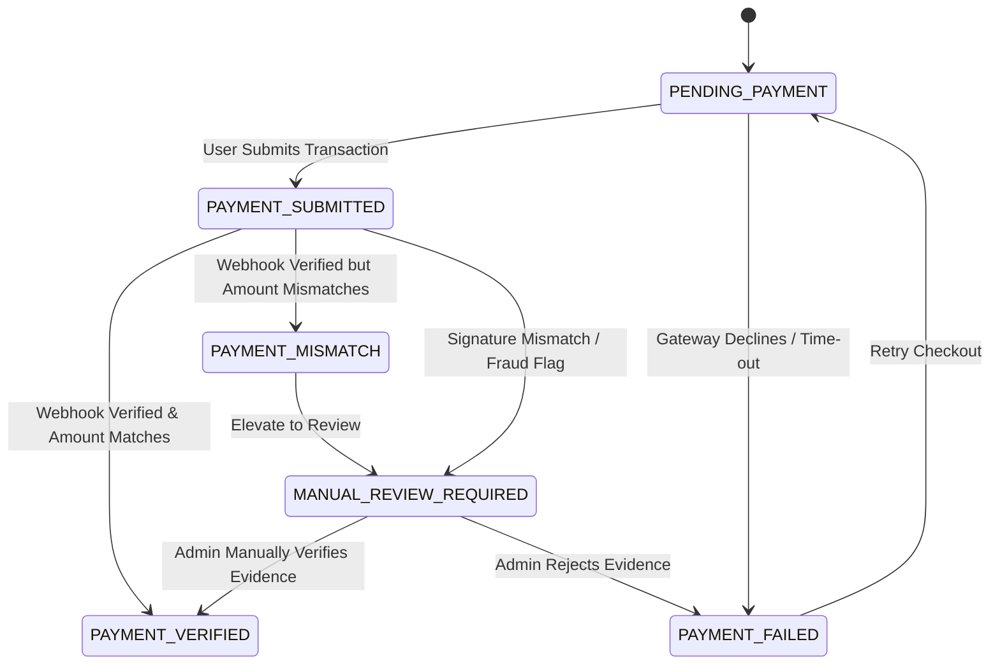
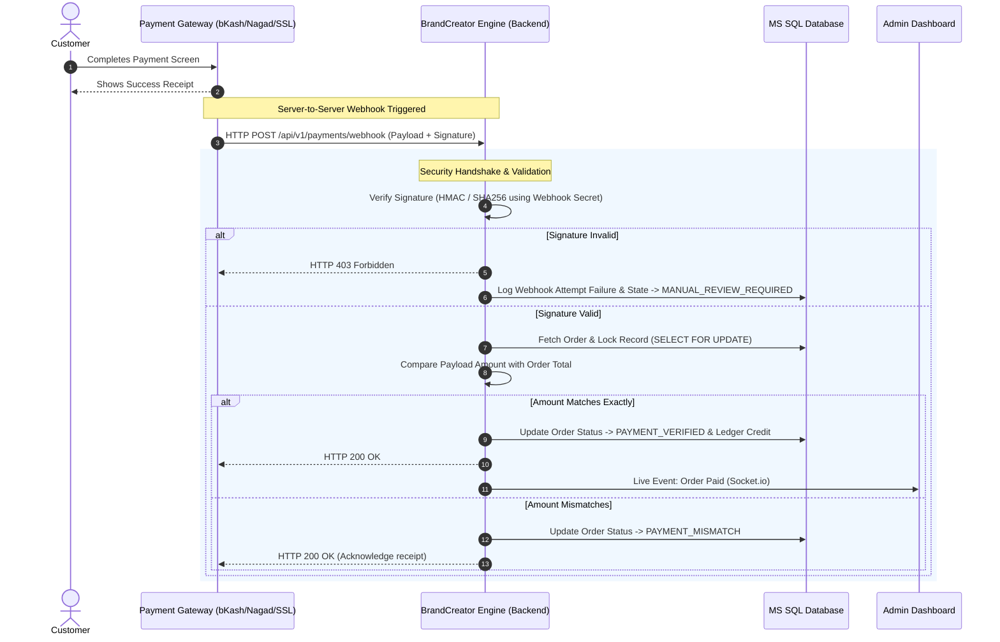

# Payment Verification Design and Workflow

This document outlines the architecture, data models, state machines, and operational procedures required to transition the **BrandCreator Ecosystem** from a simulated "blind confirmation" payment model to a production-grade, secure **Real Payment Verification Layer**.

---

## 1. Current Dev Mode Behavior

In the current development/simulated environment, the payment flow is simplified for demonstration purposes and lacks cryptographic or database-enforced integrity checks:
1. **Blind Confirmation:** A Shop user clicks "Buy Product" in the storefront, which places an order in a pending state.
2. **Manual Trust Action:** An Admin user clicks a single button labeled "Confirm Payment" in the Admin Dashboard.
3. **No Verification Ledger:** The system blindly assumes payment was received, transitions the order status to paid, and executes stock deductions without validating:
   - Whether any actual funds were transferred.
   - The transaction ID's validity or uniqueness.
   - The exact amount paid versus the order's grand total.
   - The payment gateway's signature or source of the event.

---

## 2. Production Payment States

To secure this workflow, a robust **Payment State Machine** must be implemented. Each order will transition through these states as it undergoes validation:

| State | Description | Triggering Event |
| :--- | :--- | :--- |
| `PENDING_PAYMENT` | The order has been created, and the system is waiting for the user to complete the checkout flow. | Order creation. |
| `PAYMENT_SUBMITTED` | The customer completed the gateway screen, and a Transaction ID or temporary token has been registered in the database. | Customer submits TxnID or Redirect returns. |
| `PAYMENT_VERIFIED` | The payment gateway signature is verified, the transaction is marked as complete, and the paid amount exactly matches the order total. | Valid Webhook / Query API success. |
| `PAYMENT_FAILED` | The gateway reports that the payment was cancelled, declined, expired, or had insufficient funds. | Webhook notification of failure. |
| `PAYMENT_MISMATCH` | A transaction was successfully completed and verified, but the `paidAmount` does not equal `orderTotal`. | System amount-matching check. |
| `MANUAL_REVIEW_REQUIRED` | An anomaly was detected (e.g., duplicate transaction ID, webhook signature mismatch, manual bank transfer, or payment gateway outage fallback). | Discrepancy detector or admin flag. |



---

## 3. Database Schema Extensions (Admin Order Table Fields)

To support this new layer, the database schema (e.g., `Orders` table or a separate `Payments` table linked 1:1 with `Orders`) must be extended with the following columns:

```sql
ALTER TABLE Orders ADD
    PaymentProvider VARCHAR(50) NULL,             -- 'bkash', 'nagad', 'sslcommerz', 'manual'
    TransactionID VARCHAR(100) NULL CONSTRAINT UC_TransactionID UNIQUE, -- Unique TxnID from gateway
    PaidAmount DECIMAL(18, 2) NULL,               -- The actual amount captured by the gateway
    OrderTotal DECIMAL(18, 2) NOT NULL,           -- Total amount due for the order
    PaidAt DATETIME2 NULL,                        -- Exact timestamp when payment was captured
    VerificationStatus VARCHAR(50) NOT NULL 
        CONSTRAINT DF_VerificationStatus DEFAULT 'PENDING_PAYMENT',
    GatewaySignatureStatus VARCHAR(50) NULL,      -- 'VERIFIED', 'FAILED', 'BYPASS_MANUAL'
    PaymentEvidenceNote NVARCHAR(500) NULL,       -- Note for manual audit/review
    VerifiedByAdminID INT NULL,                   -- Admin user ID who manually confirmed (if manual)
    LastModifiedAt DATETIME2 NOT NULL 
        CONSTRAINT DF_LastModifiedAt DEFAULT GETDATE();
```

---

## 4. Gateway Webhook Flow

The core of the production automated verification layer is the **Webhook Listener**. This API endpoint accepts server-to-server notifications from the gateway.



### Webhook API Security Specifications:
* **Payload HMAC Validation:** Every incoming webhook request must contain a cryptographic signature in the header (e.g., `X-SSLCommerz-Signature` or `X-bKash-Signature`). The Express engine must calculate the hash using the shared client secret key and reject non-matching packets.
* **Idempotency Check:** Before processing, check if the `TransactionID` has already been marked as `PAYMENT_VERIFIED` in the database. This prevents double-crediting or duplicate stock releases for retried webhook posts.
* **Database Ledger Auto-Trigger:** Once a payment is verified, the system triggers the stored procedure `sp_FinalizeOrderStock` to atomically transfer virtual stock from the supplier's `SELL` ledger to the customer's inventory ledger, neutralizing manual human steps.

---

## 5. Manual Payment Fallback Flow

In cases where gateways are offline, manual bank transfers occur, or a customer pays via cash on delivery, a secure manual fallback flow must be supported.

```text
               +-------------------------------------------+
               | Customer initiates checkout & selects      |
               | Manual Payment (Bank/Cash/Bkash Personal) |
               +-------------------------------------------+
                                     |
                                     v
               +-------------------------------------------+
               | Customer uploads Transaction ID / receipt |
               | and submits order. Status: PAYMENT_SUBMITTED |
               +-------------------------------------------+
                                     |
                                     v
               +-------------------------------------------+
               | Order appears in Admin Dashboard under    |
               | "MANUAL_REVIEW_REQUIRED" queue.           |
               +-------------------------------------------+
                                     |
                                     v
               +-------------------------------------------+
               | Admin checks bank/wallet statements to    |
               | confirm matching amount and reference ID. |
               +-------------------------------------------+
                                     |
                    +----------------+----------------+
                    |                                 |
         [Evidence Valid]                     [Evidence Invalid]
                    |                                 |
                    v                                 v
     +------------------------------+  +------------------------------+
     | Admin clicks "Verify Manual" |  | Admin clicks "Reject Payment"|
     | - Enters received amount     |  | - Enters rejection reason    |
     | - Enters audit notes         |  | - Status: PAYMENT_FAILED     |
     +------------------------------+  +------------------------------+
                    |                                 |
                    v                                 v
     +------------------------------+  +------------------------------+
     | DB updates Order to          |  | Order locked; notification   |
     | PAYMENT_VERIFIED. Logs admin |  | sent to customer to retry    |
     | ID & system ledger.          |  | payment.                     |
     +------------------------------+  +------------------------------+
```

---

## 6. Audit Log Requirements

Because financial transactions are legally and operationally sensitive, a complete, immutable **Audit Log** system must track all changes to payment records.

Any changes to payment columns must trigger a write to the `SystemAuditLogs` table:

```sql
CREATE TABLE PaymentAuditLogs (
    AuditLogID INT IDENTITY(1,1) PRIMARY KEY,
    OrderID INT NOT NULL,
    PreviousStatus VARCHAR(50) NOT NULL,
    NewStatus VARCHAR(50) NOT NULL,
    ActionTakenBy VARCHAR(100) NOT NULL,          -- 'SYSTEM_WEBHOOK', 'AdminName_ID', or 'CRON_CHECKER'
    ActionTimestamp DATETIME2 NOT NULL DEFAULT GETDATE(),
    ChangeDescription NVARCHAR(1000) NOT NULL,    -- Detailed breakdown of changes
    IPAddress VARCHAR(45) NULL,
    UserAgent VARCHAR(255) NULL
);
```

### Logging Rules:
1. **No Hard Deletes:** Deletion of any record with a `TransactionID` or `PaidAmount` > 0 is strictly blocked at the SQL Server database level using a database trigger.
2. **Reconciliation Cron Logs:** A nightly cron job must query payment gateway APIs directly (e.g., bKash Query Transaction API) to match all `PAYMENT_SUBMITTED` orders older than 3 hours, attempting to resolve their states to `PAYMENT_VERIFIED` or `PAYMENT_FAILED`. Every resolution must write a reconciliation log entry.

---

## 7. Recommended Implementation Phases

Implementing real payment integration should follow a structured, low-risk phased approach:

### Phase 1: Database Schema & Mock Verification Layer (Sprint 1)
* **Goal:** Extend database tables, set up the `PaymentState` enumerations in backend/frontend, and replace the blind click with a mock verification modal in the Admin Dashboard.
* **Deliverable:** UI inputs for mock provider selection, simulated Transaction ID entry, and simulated amount mismatch rejection flow.

### Phase 2: Sandbox Integration & Webhook Handler (Sprint 2)
* **Goal:** Register with payment gateways (SSLCommerz Sandbox, bKash Sandbox) and build backend endpoint listeners.
* **Deliverable:** Secure API endpoint `/api/v1/payments/webhook` with HMAC signature validation algorithms running successfully against gateway test mock payloads.

### Phase 3: Live Query API & Reconciliation Job (Sprint 3)
* **Goal:** Integrate transaction queries for manual fallback verification and set up cron reconciliations.
* **Deliverable:** A background query script that connects to bKash/Nagad API via token endpoints to poll transaction statuses.

### Phase 4: Production Switch, Least-Privilege DB Lockdown & Audit Logging (Sprint 4)
* **Goal:** Lock down database permissions, transition endpoints to production URLs, and deploy audit logging.
* **Deliverable:** Live, active bKash/Nagad checkout with automated ledger distribution on successful webhook callbacks.

---
**Created File Location:**  
`bc_docs/payment_verification_workflow.md`
