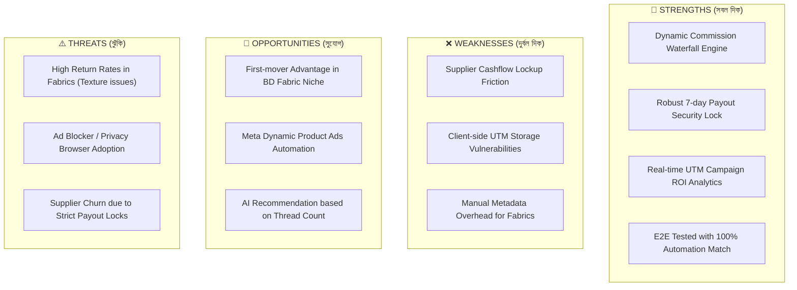

# BrandCreator Ecosystem — Comprehensive Project Evaluation & SWOT Manual
## 🎯 কৌশলগত মূল্যায়ন: সবলতা, দুর্বলতা, সুযোগ ও ঝুঁকির বিশ্লেষণ (Valo-Mondo Analysis)

এই ডকুমেন্টটিতে BrandCreator Ecosystem-এর **Phase 3A: Fabrics Engine, Payout Return-Window Lock, এবং UTM Attribution Engine**-সহ সামগ্রিক সিস্টেমের একটি নিরপেক্ষ ও অত্যন্ত বিস্তারিত মূল্যায়ন (Evaluation) তুলে ধরা হয়েছে। ব্যবসায়িক সফলতার জন্য সিস্টেমের চমৎকার দিকগুলোর (Good/Pros) পাশাপাশি এর সীমাবদ্ধতা এবং সম্ভাব্য ঝুঁকির (Bad/Cons) দিকগুলো জেনে রাখা অত্যন্ত জরুরি।

---

## 📊 ১. এক নজরে BrandCreator-এর মূল উপাদানসমূহ (Platform Core Components)

আমাদের ইকোসিস্টেমের বর্তমান আর্কিটেকচারটি ৩টি স্তম্ভের উপর দাঁড়িয়ে আছে:
1. **Waterfall Commission Engine**: 'OWN' (নিজস্ব) এবং 'SUPPLIER' (মার্কেটপ্লেস) পণ্যের জন্য স্বয়ংক্রিয় কমিশন হিসাব পদ্ধতি।
2. **Payout Return-Window System Lock**: গ্রাহকের ৭ দিনের রিটার্ন সময়সীমা শেষ না হওয়া পর্যন্ত সাপ্লায়ারের পেমেন্ট স্বয়ংক্রিয়ভাবে লক রাখার সিকিউরিটি মেকানিজম।
3. **Auto UTM Attribution Engine**: ফেসবুক ও গুগল অ্যাডস থেকে আসা ভিজিটরদের ট্র্যাক করে রিয়েল-টাইম ROI এবং ROAS হিসাব করার ট্র্যাকিং সিস্টেম।
4. **Dynamic Fabrics Catalog Feed**: ফেসবুক ক্যাটালগ ও ডাইনামিক প্রোডাক্ট অ্যাডসের (DPA) জন্য মেটা-কমপ্লায়েন্ট XML ফিড জেনারেটর।

---

## 🟢 ২. ভালো দিক ও ব্যবসায়িক সুবিধা সমূহ (The "GOOD" — Strengths & Strategic Advantages)

### ✅ ক) স্বয়ংক্রিয় পেমেন্ট সিকিউরিটি (Automated Financial Risk Mitigation)
* **শূন্য আর্থিক ক্ষতি (Zero Chargeback Risk):** রিটার্ন উইন্ডো লক সিস্টেম নিশ্চিত করে যে কোনো ক্রেতা পণ্য ফেরত দেওয়ার আগেই সাপ্লায়ারকে ভুলবশত পেমেন্ট করা সম্ভব নয়। ৭ দিন শেষ হওয়ার পর সিস্টেম নিজে থেকে লক রিলিজ করে।
* **ড্যাশবোর্ড ইন্টিগ্রেশন:** অ্যাডমিন ও সাপ্লায়ার উভয় ড্যাশবোর্ডে রিয়েল-টাইম `🔒 LOCKED` এবং `🔑 RELEASED` ব্যাজ প্রদর্শিত হয়, যা স্বচ্ছতা নিশ্চিত করে এবং অ্যাডমিনের ভুল পেমেন্ট করার মানবিক ভুল দূর করে।

### ✅ খ) অ্যাডস মার্কেটিং এবং আরওআই ট্র্যাকিং (Data-Driven ROI Attribution)
* **সঠিক ক্যাম্পেইন ট্র্যাকিং (Granular Attribution):** প্রতিটি ক্যাম্পেইনের জন্য কাস্টম UTM লিংক জেনারেট করা যায় (যেমন: `FB-ADS-DHANMONDI`, `FB-ADS-MIRPUR`, `FB-ADS-UTTARA`)। ক্রেতা কোন লিংক থেকে এসে অর্ডার করেছেন তা নিখুঁতভাবে `Orders` ও `OrderProfitBreakdowns` টেবিলে সংরক্ষিত হয়।
* **রিয়েল-টাইম ROI ড্যাশবোর্ড:** অ্যাডমিন প্যানেলে সরাসরি দেখা যায় কোন এরিয়ার বিজ্ঞাপনে কত টাকা খরচ হয়েছে এবং সেখান থেকে কত টাকা নেট প্রফিট অর্জিত হয়েছে। এটি বিজ্ঞাপন বাজেট অপটিমাইজ করতে সাহায্য করে।

### ✅ গ) মেটা ডাইনামিক অ্যাডস সাপোর্ট (Meta Dynamic Ads Integration)
* **রিয়েল-টাইম এক্সএমএল ফিড:** `/api/catalog/fb-feed` এন্ডপয়েন্টটি সম্পূর্ণ পাবলিক এবং রিয়েল-টাইম মেটা ক্রলার কমপ্লায়েন্ট। এর মাধ্যমে স্বয়ংক্রিয়ভাবে ফেসবুক ক্যাটালগে Fabrics attributes (যেমন: Thread Count, Material, Weaving Type) আপডেট হয়ে যায়।
* **ডাইনামিক রিয়েক্টিভ রিটার্গেটিং:** যেসকল ক্রেতা শপ পেজ ভিজিট করেছেন কিন্তু অর্ডার করেননি, ফেসবুক তাদের ফ্যাব্রিক কাস্টম লেবেল অনুযায়ী রি-টার্গেটিং বিজ্ঞাপন দেখাতে পারে।

---

## 🔴 ৩. চ্যালেঞ্জ, দুর্বলতা ও সীমাবদ্ধতা (The "BAD" — Weaknesses, Risks & Operational Bottlenecks)

ব্যবসায়িক কার্যক্রমকে ঝুঁকিমুক্ত রাখতে নিচের সীমাবদ্ধতা ও চ্যালেঞ্জগুলো গুরুত্বের সাথে বিবেচনা করতে হবে:

### ⚠️ ক) সাপ্লায়ারের ক্যাশ-ফ্লো চাপ (Supplier Cash-Flow Pressure)
* **সমস্যা (The Cons):** ৭ দিনের স্ট্রিক্ট পেমেন্ট হোল্ড সাপ্লায়ারদের ক্যাশ-ফ্লোতে চাপ সৃষ্টি করতে পারে, বিশেষ করে ক্ষুদ্র উদ্যোক্তাদের ক্ষেত্রে যারা দ্রুত টাকা তুলে আবার কাঁচামাল কিনতে চান।
* **প্রভাব:** অতিরিক্ত কড়াকড়ির কারণে সাপ্লায়াররা প্ল্যাটফর্মে পণ্য আপলোড করতে নিরুৎসাহিত হতে পারেন।

### ⚠️ খ) ব্রাউজার কুকি ও ট্র্যাকিং সীমাবদ্ধতা (Attribution Blind-spots)
* **সমস্যা (The Cons):** আমাদের ট্র্যাকিং সিস্টেমটি মূলত ব্রাউজার `sessionStorage` এবং URL প্যারামিটারের উপর নির্ভরশীল। যদি কোনো কাস্টমার Safari Incognito ব্যবহার করেন বা ব্রাউজার কুকি ব্লক করে রাখেন, তবে UTM ট্র্যাকিং ডেটা মিস হতে পারে।
* **প্রভাব:** বিজ্ঞাপন ক্যাম্পেইনের সঠিক ROI ড্যাশবোর্ডে 'Organic/Direct' হিসেবে দেখাবে, যার ফলে ক্যাম্পেইন পারফরম্যান্সের ভুল মূল্যায়ন হতে পারে।

### ⚠️ গ) ডাটাবেজ পারফরম্যান্স লোড (Database Growth & Performance Overhead)
* **সমস্যা (The Cons):** প্রতিটি অর্ডারের সাথে UTM সোর্স সংরক্ষণ এবং কমিশন লেজার ও ওয়ালেট ট্র্যাকিংয়ের জন্য জটিল SQL কোয়েরি রান করতে হয়। ট্রাফিকের পরিমাণ অনেক বেড়ে গেলে অ্যানালিটিক্স কোয়েরির কারণে ডাটাবেজ স্লো হতে পারে।
* **প্রভাব:** অ্যাডমিন ড্যাশবোর্ড লোড হতে বেশি সময় নিতে পারে।

### ⚠️ ঘ) ফ্যাব্রিক ক্যাটালগ এন্ট্রি ওভারহেড (Metadata Overhead)
* **সমস্যা (The Cons):** মেটা ডাইনামিক অ্যাডস সফল করতে প্রতিটি কাপড়ের জন্য Material, Texture, Width, Thread Count, Weaving Type নিখুঁতভাবে ইনপুট দিতে হবে। সাপ্লায়ারদের জন্য এই টেকনিক্যাল ডেটাগুলো এন্ট্রি করা ঝামেলার হতে পারে।
* **প্রভাব:** অসম্পূর্ণ ডেটার কারণে ফেসবুক ক্যাটালগে রিজেকশন আসতে পারে।

---

## 🛠️ ৪. কৌশলগত সমাধান ও প্রশমন পরিকল্পনা (Actionable Mitigations)

| চিহ্নিত দুর্বলতা (The Cons) | আমাদের প্রস্তাবিত সমাধান (Strategic Mitigation) | বাস্তবায়ন পদ্ধতি (How to Solve) |
|:---|:---|:---|
| **সাপ্লায়ার ক্যাশ-ফ্লো চাপ** | **Dynamic Escrow Period Tiers** | বিশ্বস্ত ও ভেরিফায়েড সাপ্লায়ারদের জন্য পেমেন্ট লক উইন্ডো ৭ দিন থেকে কমিয়ে ৩ দিনে আনা যেতে পারে (যাদের রিটার্ন রেট ২%-এর নিচে)। |
| **ব্রাউজার ট্র্যাকিং ব্লক** | **Server-Side API Handshake (Conversion API)** | ভবিষ্যতে ব্রাউজার ট্র্যাকিংয়ের পাশাপাশি Meta Conversions API (CAPI) যুক্ত করে সার্ভার-টু-সার্ভার পিক্সেল ট্র্যাকিং চালু করা। |
| **ডাটাবেজ পারফরম্যান্স চাপ** | **Read-Heavy Query Caching (Redis)** | ক্যাম্পেইন ROI অ্যানালিটিক্স এবং কমিশন লেজার ডেটা ৫ মিনিটের জন্য ক্যাশ (Redis) করে রাখা, যাতে সরাসরি ডেটাবেজে বারবার হিট না হয়। |
| **ক্যাটালগ এন্ট্রি জটিলতা** | **AI-Powered Fabric Metadata Ingestion** | সাপ্লায়ার শুধু কাপড়ের ছবি ও নাম আপলোড করবেন, ব্যাকএন্ড AI ইমেজ অ্যানালাইসিস করে স্বয়ংক্রিয়ভাবে Material ও Weaving Type সাজেস্ট করবে। |

---

## 🎯 ৫. SWOT विश्लेषण ম্যাট্রিক্স (BrandCreator SWOT Matrix)

---

## 📈 ৬. ROAS পারফরম্যান্স এবং প্রফিট প্রজেকশন টিয়ারส์ (ROAS Projection Matrix)

বিজ্ঞাপন খরচের বিপরীতে প্ল্যাটফর্মের নেট প্রফিট প্রজেকশন নিচে দেওয়া হলো:

| ROAS Tier | প্রফিট পারফরম্যান্স | এডস বাজেট রেঞ্জ (মাসিক) | প্ল্যাটফর্ম নেট প্রফিট মার্জিন | রেকমেন্ডেশন ও অ্যাকশন |
|:---:|:---:|:---:|:---:|:---|
| **Tier 1 (High: 3.5x+)** | 🌟 চমৎকার ক্যাশ জেনারেটর | ৳৫০,০০০ - ৳২,০০,০০০ | **১২% - ১৫%** | বাজেট দ্বিগুণ করুন এবং Dhanmondi/Uttara এরিয়ার টার্গেটিং বাড়ান। |
| **Tier 2 (Mod: 2.0x+)** | ⚖️ স্থিতিশীল ও নিরাপদ | ৳৩০,০০০ - ৳৮০,০০০ | **৫% - ৯%** | রিটার্গেটিং অ্যাডস বাড়ান এবং Fabrics filters পেজে ডিসকাউন্ট অফার করুন। |
| **Tier 3 (Low: <1.5x)** | ⚠️ ব্রেক-ইভেন বা লস | ৳১০,০০০ - ৳৩০,০০০ | **০% - ৪%** | ল্যান্ডিং পেজ স্পিড চেক করুন, কাপড়ের হাই-কোয়ালিটি ভিডিও যোগ করুন। |

---

## 🏁 ৭. ইকোসিস্টেম রিলিজ ও গো-লাইভ গাইডলাইন (Operational Go-Live Steps)

সিস্টেমটি লাইভ করার আগে আমাদের এই পদক্ষেপগুলো অনুসরণ করতে হবে:
1. **ক্যাটালগ ফিড সাবমিশন:** ফেসবুক কমার্স ম্যানেজারে গিয়ে ডেটা সোর্স হিসেবে `http://localhost:5000/api/catalog/fb-feed` (প্রোডাকশনে আপনার ডোমেইন) যুক্ত করুন এবং প্রতি ১ ঘন্টা পর পর অটো-সিঙ্ক অন করুন।
2. **ক্ষুদ্র সাপ্লায়ার ও ওরিয়েন্টেশন:** সাপ্লায়ারদের একটি সংক্ষিপ্ত ইমেইল বা মেসেজের মাধ্যমে পেমেন্ট লকের ব্যাপারে স্পষ্ট ব্যাখ্যা দিন, যাতে তারা বোঝেন যে এটি প্ল্যাটফর্মের রিটার্ন পলিসি এবং ক্রেতার আস্থা নিশ্চিত করতে করা হয়েছে।
3. **লোকেশন টার্গেটিং সেটআপ:** মেটা অ্যাড ম্যানেজারে বাজেট সেট করার সময় আমাদের সিস্টেমের সাজেশন অনুযায়ী `Dhaka`, `Chittagong`, এবং `Sylhet` এর জন্য হাইপারলোকাল ক্যাম্পেইন সেট করুন।

---
*ডকুমেন্টটি চূড়ান্তভাবে প্রস্তুত করা হয়েছে এবং যেকোনো ব্যবসায়িক প্রেজেন্টেশন বা স্ট্রাটেজি মিটিংয়ে উপস্থাপনের জন্য এটি সম্পূর্ণরূপে কার্যকর।*
